<!-- EJW LOGO -->
<a name="readme-top"></a>
<br />
<div align="center">
  <a href="https://github.com/ejwleo/amosweb">
    
  </a>

  <h3 align="center">amosWEB Text- und E-Mail-Vorlagen</h3>

  <p align="center">
    Wir haben viel Zeit, Herzblut und Arbeit in die Erstellung unserer Texte und E-Mail-Vorlagen innerhalb von amosWEB gesteckt. Da wir dazu bereits mehrfach angesprochen wurden haben wir uns entschieden, diese online zur freien Verfügung zu stellen.
    <br />
    <br />
    ⚠ <b>Achtung:</b> <i>Wir erheben keinen Anspruch auf Vollständigkeit, rechtliche Sicherheit oder sonstige Gewährleistungen. <u>Verwendung auf eigene Verantwortung.</u> Falls ihr Fehler entdeckt würden wir uns sehr über einen kurzen Hinweis dazu freuen! :)</i>
    <br />
    <br />
    <a href="https://www.amosweb.de/">zu amosWEB</a>
    ·
    <a href="https://ejwleo.de/">Über das Ev. Jugendwerk Bezirk Leonberg</a>
    ·
    <a href="https://ejwleo.de/foerderverein/">Danke sagen</a>
  </p>
</div>

<hr>

<!-- TABLE OF CONTENTS -->
<details>
  <summary><b>Inhaltsverzeichnis</b></summary>
  <br />
  <ol>
    <li>
      <a href="#hintergrund">Hintergrund</a>
      <ul>
        <li><a href="#aufbau">Aufbau</a></li>
        <li><a href="#hinweise-und-tipps">Hinweise und Tipps</a></li>
      </ul>
    </li>
    <li><a href="#anwendung">Anwendung</a></li>
    <li>
      <a href="#e-mail-vorlagen">E-Mail-Vorlagen</a>
    </li>
    <li>
      <a href="#dokument-vorlagen">Dokument-Vorlagen</a>
    </li>
    <li><a href="#faq">FAQ</a></li>
  </ol>
</details>

<hr>

## Hintergrund

Mit E-Mail-Vorlagen innerhalb von amosWEB kannst du deine E-Mails, die das System automatisiert bei bestimmten Anlässen verschickt gestalten und an deine Bedürfnisse anpassen. Als [Bezirksjugendwerk](https://ejwleo.de/) haben wir dies in akribischer Arbeit nach dem Umstieg auf amosWEB erledigt und unsere Texte sowie die generelle Darstellung lange optimiert, bis sie für unsere Zwecke - das Anmeldemanagement für unsere (Sommer-)Freizeiten und Jugendangebote - passend waren.

> E-Mail-Vorlagen kannst du in amosWEB entweder innerhalb einer Veranstaltung oder mandant-weit ("global") innerhalb von **amosWEB** festlegen. ➡ **Wir empfehlen letzteres, da du so diese an nur einem ort zentral hinterlegt hast und Änderungen einfacher dort standardmäßig für alle Veranstaltungen gültig sind, solange du sie nicht lokal überschreibst.**

### Aufbau

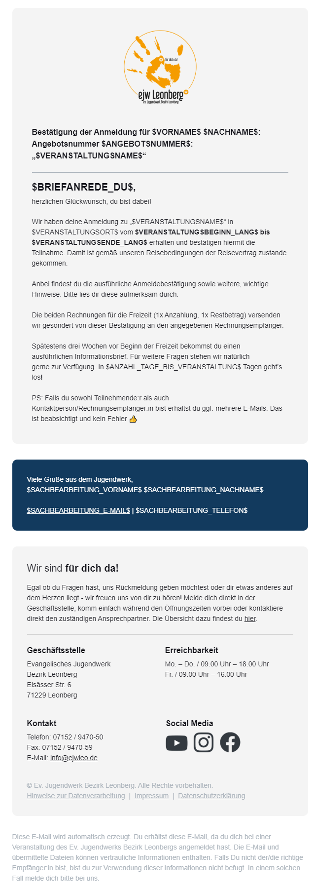

Der Aufbau & das Design unserer Vorlage gliedert sich in mehrere Blöcke:

1. Logo der Organisation
1. Betreffzeile/Überschrift
1. Haupt-Textabschnitt inkl. persönlicher Anrede
1. Kontaktdaten des Absenders (i.d.R. Sachbearbeiter*in)
1. allgemeine Informationen & Angaben zur Organisation (Öffnungszeiten, Kontaktdaten, Ansprechpartner, Social-Media)
1. Rechtliche Angaben (Impressum, Datenschutz, ...)
1. Herkunftsangaben der E-Mail (für Transparenz gegenüber Empfänger)

### Hinweise und Tipps

Bitte beachte bei der Verwendung unserer Vorlagen noch folgende Hinweise:

- Die E-Mail-Vorlagen enthalten Platzhalter-Texte, damit nicht aus Versehen unsere realen Inhalte wie IBAN, Öffnungszeiten oder Ansprechpartner übernommen werden. ➡ Bitte tausche diese vor der Übernahme gegen deine aus.
- Das eingebettete Logo im Kopf solltest du ebenfalls gegen dein eigenes austauschen.
- In der Vorlage binden wir Icons für die sozialen Netzwerke ein. Du kannst als Quelle für diese Grafiken entweder den hinterlegten Link beibehalten oder die Dateien [hier](https://github.com/ejwleo/amosweb/blob/main/assets/) herunterladen und auf eurem eigenen Webserver/Website hochladen und von dort verknüpfen.
- Beim einfügen der E-Mail-Vorlagen wird **nur** der Mail-Körper übernommen, jedoch nicht der Betreff, etwaige weitere Empfänger im `CC`/`BCC` und/oder Anhänge oder Filter-Regeln. Falls wir diese für empfehlenswert halten sind diese unten entsprechend angegeben.
- Je nach Logik und Filtern kann es passieren, dass Teilnehmende (wenn diese bspw. sowohl TN als auch RE sind) E-Mails doppelt bekommen. ➡ Damit hier keine Missverständnisse entstehen haben wir dazu einen entsprechenden Hinweis in unsere Vorlagen integriert.
- 💡 **Tipp:** Nimm eine beliebige Vorlage als Ausgangsbasis, passe daran alle entsprechenden Texte an deine Bedürfnisse an, ändere ggf. Farben und Logos und speichere diese Vorlage anschließend einmal für dich ab.
- Der Editor von amosWEB unterstützt bisher keine Hervorhebungen/fett-markierte Texte - in unseren Vorlagen haben wir diese jeweils manuell im HTML-Editor angepasst durch das hinzufügen von `<b>` bzw. `</b>` jeweils vor & nach dem zu fettenden Teil ➡ `<b>Dieser Text ist fett hervorgehoben</b>`
- 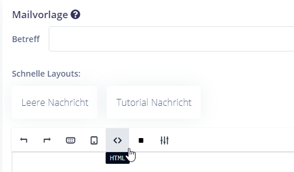
- Unsere Vorlage kannst du natürlich auch über den in amosWEB integrierten Editor bearbeiten. **Wo möglich solltest du dies auch tun!**

<p align="right">(<a href="#readme-top">🔼 zurück nach Oben</a>)</p>

## Anwendung

Die Anwendung unserer Vorlagen ist sehr einfach. Lass dich nicht abschrecken von Code - du musst kein Verständnis von Programmieren oder dem abgebildeten Code haben!


_Screencast-Aufzeichnung zur Verwendung der E-Mail-Vorlagen_

1. Wechsle zu den Einstellungen - E-Mails - E-Mail-Vorlagen
1. Wähle die zu bearbeitende Vorlagensektion durch Klick auf das Stift-Icon aus
1. Klicke nun auf "Neue Mailvorlage" - daraufhin öffnet sich die neue Mail-Vorlage
1. Klicke nun auf das HTML-Symbol, um dir den HTML-Code der Vorlage anzuzeigen
1. Markiere den kompletten Text darin (STRG/CMD + A, danach ENTF) und füge anschließend die gewünschte Vorlage ein
1. Verlasse den HTML-Code-Editor über ein erneutes Drücken auf den HTML-Button
1. Vergiss nicht, nun noch den Betreff der Vorlage entsprechend anzupassen. Setze bei Bedarf noch E-Mail-Adressen in den CC/BCC-Bereich, wähle einen Dateianhang links aus und/oder setze links Filter, wann diese Vorlage aktiviert werden soll.

<p align="right">(<a href="#readme-top">🔼 zurück nach Oben</a>)</p>

## E-Mail-Vorlagen

_Legende:_ 🗓 Veranstaltungsmails (im Kontext einer Veranstaltung) 💵 allgemein Rechnungsmails

---

- 💡 Idealerweise verwendest du nachfolgend nur den eigentlichen Mail-Text und hast den generellen Look & die Grundstruktur bereits für dich als personalisierte Vorlage abgespeichert. Daher stellen wir nachfolgend nur die eigentlichen Mail-Texte bereit.
- 💡 In den folgenden Vorlagen zeigt das Vorschau-Bild nur den eigentlichen Mailtext, da sich die Inhalte der Vorlage darüber & darunter nicht ändern - siehe dazu auch [Aufbau der Vorlage](#aufbau)

---

 [👉 **Hier** 👈](https://github.com/ejwleo/amosweb/blob/main/basis-vorlage.txt/) findest du eine Basis-Vorlage, gefüllt mit Beispieltext. Diese solltest du als Ausgangsbasis nehmen, um darin deine Daten anzupassen. Bei der Erstellung der jeweiligen Vorlagen kannst du dich dann an unseren angegebenen Texten orientieren.

---

### 🗓 Mails an die Angemeldeten einer Veranstaltung

#### Angemeldete/r bestätigt

Filter, Anhänge und Hinweise:

- Filter ⚙: `Teilnehmerart` ist `Teilnehmer`
- Anhänge 🔗:  [📄 Anmeldebestätigung TN mit Anzahlung](#Anmeldebestaetigung-TN-mit-Anzahlung)
- Bemerkung 💡: Wenn eine Veranstaltung keine (!) Anzahlung enthält muss die VOrlage lokal in der Veranstaltung überschrieben werden mit angepasstem Wortlaut.

Betreff:

```
Anmeldebestätigung für $VERANSTALTUNGSNAME$
```

E-Mail-Vorschautext:

```
$BRIEFANREDE_DU$, herzlichen Glückwunsch, du bist dabei!
```

E-Mail-Text:

```
Bestätigung der Anmeldung für $VORNAME$ $NACHNAME$: Angebotsnummer $ANGEBOTSNUMMER$: „$VERANSTALTUNGSNAME$“
---
Wir haben deine Anmeldung zu „$VERANSTALTUNGSNAME$“ in $VERANSTALTUNGSORT$ vom $VERANSTALTUNGSBEGINN_LANG$ bis $VERANSTALTUNGSENDE_LANG$ erhalten und bestätigen hiermit die Teilnahme. Damit ist gemäß unseren Reisebedingungen der Reisevertrag zustande gekommen.

Anbei findest du die ausführliche Anmeldebestätigung sowie weitere, wichtige Hinweise. Bitte lies dir diese aufmerksam durch.

Die beiden Rechnungen für die Freizeit (1x Anzahlung, 1x Restbetrag) versenden wir gesondert von dieser Bestätigung an den angegebenen Rechnungsempfänger.

Spätestens drei Wochen vor Beginn der Freizeit bekommst du einen
ausführlichen Informationsbrief. Für weitere Fragen stehen wir natürlich
gerne zur Verfügung. In $ANZAHL_TAGE_BIS_VERANSTALTUNG$ Tagen geht’s los!

PS: Falls du sowohl Teilnehmende:r als auch Kontaktperson/Rechnungsempfänger:in bist erhältst du ggf. mehrere E-Mails. Das ist beabsichtigt und kein Fehler 👍
```

<details>
  <summary>🖥 Vorschau</summary>
  
  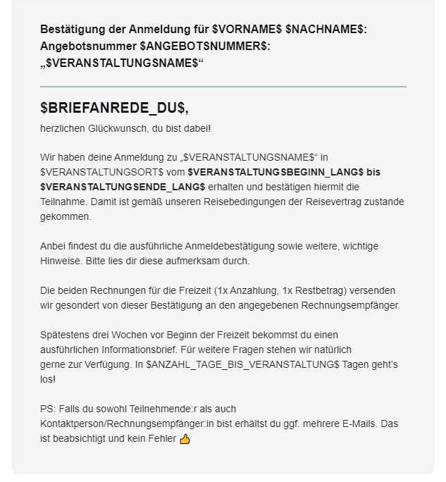

</details>

---

Filter, Anhänge und Hinweise:

- Filter ⚙: `Teilnehmerart` ist `Betreuer`
- Anhänge 🔗: - / -
- Bemerkung 💡: - / -

Betreff:

```
Anmeldebestätigung für $VERANSTALTUNGSNAME$
```

E-Mail-Vorschautext:

```
$BRIEFANREDE_DU$, herzlichen Glückwunsch, du bist als Mitarbeiter dabei!
```

E-Mail-Text:

```
Bestätigung der Mitarbeiter-Anmeldung für $VORNAME$ $NACHNAME$: Angebotsnummer $ANGEBOTSNUMMER$: „$VERANSTALTUNGSNAME$“
---
$BRIEFANREDE_DU$,
herzlichen Glückwunsch, du bist als Mitarbeiter dabei! Wir sind sehr dankbar, dass du uns unterstützt!

Wir haben deine Anmeldung zu „$VERANSTALTUNGSNAME$“ vom $VERANSTALTUNGSBEGINN_LANG$ bis $VERANSTALTUNGSENDE_LANG$ erhalten und bestätigen hiermit die Teilnahme. Wir haben dich im Team $BETREUERFUNKTION$ zugeordnet.

Weitere Informationen zum Ablauf und der Vorbereitung erhältst du in der Regel direkt von der Freizeitleitung. Für weitere Fragen stehen wir natürlich
gerne zur Verfügung. In $ANZAHL_TAGE_BIS_VERANSTALTUNG$ Tagen geht’s los!

PS: Falls du sowohl Mitarbeitende:r als auch Kontaktperson bist erhältst du ggf. mehrere E-Mails. Das ist beabsichtigt und kein Fehler 👍 
```

<details>
  <summary>🖥 Vorschau</summary>
  
  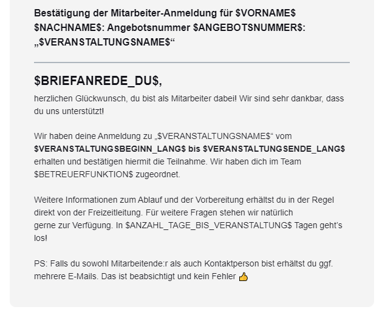

</details>

#### Angemeldete/r storniert

- Filter ⚙: - / -
- Anhänge 🔗: - / -
- Bemerkung 💡: Da die Meldung über die Stornierung **nur** an die Teilnehmenden geht setzen wri heir die E-Mail-Adresse der Kontaktperson in CC, damit auch diese (i.d.R. Eltern) informiert werden.
- CC: `$ANMELDUNG_E-MAIL$`

Betreff:

```
Stornierung der Anmeldung für $VERANSTALTUNGSNAME$
```

E-Mail-Vorschautext:

```
$BRIEFANREDE_DU$, wir haben deine Anmeldung zu „$VERANSTALTUNGSNAME$“ in $VERANSTALTUNGSORT$ vom $VERANSTALTUNGSBEGINN_LANG$ bis $VERANSTALTUNGSENDE_LANG$ storniert.
```

E-Mail-Text:

```
Stornierung der Anmeldung für $VORNAME$ $NACHNAME$: Angebotsnummer $ANGEBOTSNUMMER$: „$VERANSTALTUNGSNAME$“ in $VERANSTALTUNGSORT$
---
$BRIEFANREDE_DU$,
wir haben deine Anmeldung zu „$VERANSTALTUNGSNAME$“ in $VERANSTALTUNGSORT$ vom $VERANSTALTUNGSBEGINN_LANG$ bis $VERANSTALTUNGSENDE_LANG$ storniert.

Solltest du noch offene Fragen haben, melde dich gern in der Geschäftsstelle.

PS: Falls du sowohl Teilnehmende:r als auch Kontaktperson/Rechnungsempfänger:in bist erhältst du ggf. mehrere E-Mails. Das ist beabsichtigt und kein Fehler 👍 
```

<details>
  <summary>🖥 Vorschau</summary>
  
  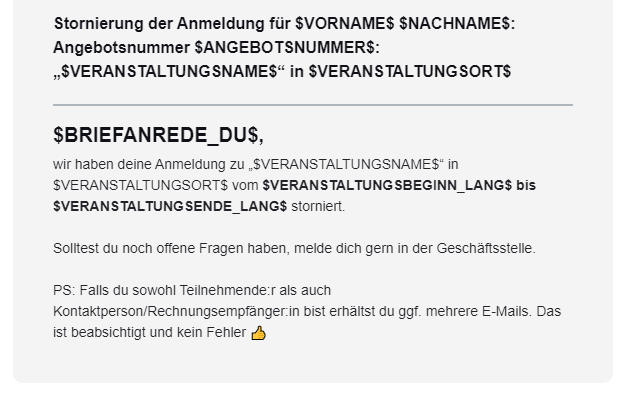

</details>

#### Angemeldete/r auf Warteliste gesetzt

- Filter ⚙: - / -
- Anhänge 🔗:  [📄 Information über Warteliste](#Anmeldung-TN-Information-Wartenliste)
- Bemerkung 💡: Da die Meldung der Platzierung auf der Warteliste **nur** an die Teilnehmenden geht setzen wri heir die E-Mail-Adresse der Kontaktperson in CC, damit auch diese (i.d.R. Eltern) informiert werden.
- CC: `$ANMELDUNG_E-MAIL$`

Betreff:

```
Wartelistenplatz für $VERANSTALTUNGSNAME$
```

E-Mail-Vorschautext:

```
$BRIEFANREDE_DU$, wir haben deine Anmeldung vom $ANMELDEDATUM_LANG$ zu „$VERANSTALTUNGSNAME$“ vom $VERANSTALTUNGSBEGINN_LANG$ bis $VERANSTALTUNGSENDE_LANG$ erhalten.
```

E-Mail-Text:

```
Information über Wartelisten-Platz für $VORNAME$ $NACHNAME$: Angebotsnummer $ANGEBOTSNUMMER$: „$VERANSTALTUNGSNAME$“ in $VERANSTALTUNGSORT$
---
$BRIEFANREDE_DU$,

wir haben deine Anmeldung zu „$VERANSTALTUNGSNAME$“ in $VERANSTALTUNGSORT$ 
vom $VERANSTALTUNGSBEGINN_LANG$ bis $VERANSTALTUNGSENDE_LANG$ erhalten.

Leider ist die Freizeit bereits voll belegt. Wir können dir deshalb im Moment
keine Zusage geben.

Wir haben deine Anmeldung auf unsere Warteliste gesetzt.
Wenn wir eine Abmeldung von der Freizeit bekommen, rückt deine Anmeldung
automatisch nach. Falls dies der Fall sein sollte, erhältst du von uns sofort Bescheid.

Wenn wir dich von unserer Warteliste streichen sollen, gib uns bitte Bescheid.
Für Rückfragen stehen wir gerne telefonisch oder per E-Mail zu Verfügung

PS: Falls du sowohl Teilnehmende:r als auch Kontaktperson/Rechnungsempfänger:in bist erhältst du ggf. mehrere E-Mails. Das ist beabsichtigt und kein Fehler 👍 
```

<details>
  <summary>🖥 Vorschau</summary>
  
  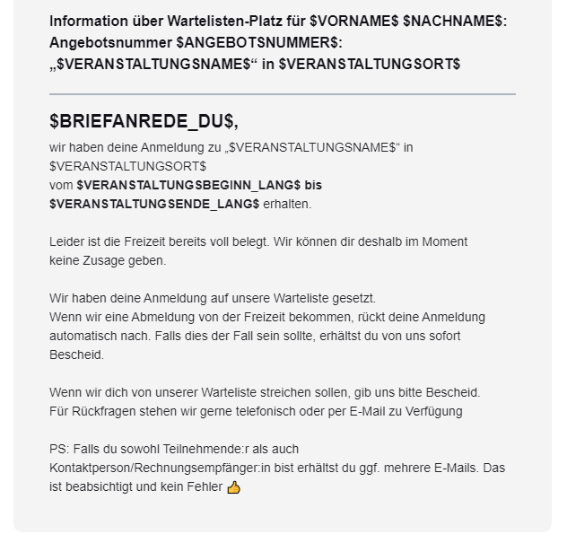

</details>

#### Veranstaltungserinnerung versenden

- Filter ⚙: - / -
- Anhänge 🔗: - / -
- Bemerkung 💡: - / -

Betreff:

```
In $ANZAHL_TAGE_BIS_VERANSTALTUNG$ gehts los! $VERANSTALTUNGSNAME$
```

E-Mail-Vorschautext:

```
$BRIEFANREDE_DU$, in $ANZAHL_TAGE_BIS_VERANSTALTUNG$ Tagen geht es endlich los!
```

E-Mail-Text:

```
$BRIEFANREDE_DU$,
in $ANZAHL_TAGE_BIS_VERANSTALTUNG$ Tagen geht es endlich los!

Wir hoffen, die Vorfreude steigt auch auf deiner Seite bereits - das Team im Jugendwerk freut sich bereits auf dich & die gemeinsame Zeit mit dir!

Alle notwendigen Informationen hast du zum jetzigen Zeitpunkt bereits erhalten - sollten bei dir aber noch Fragen offen sein melde dich gern jederzeit bei uns in der Geschäftsstelle. Wir freuen uns auf dich!

PS: Falls du sowohl Teilnehmende:r als auch Kontaktperson/Rechnungsempfänger:in bist erhältst du ggf. mehrere E-Mails. Das ist beabsichtigt und kein Fehler 👍 
```

<details>
  <summary>🖥 Vorschau</summary>
  
  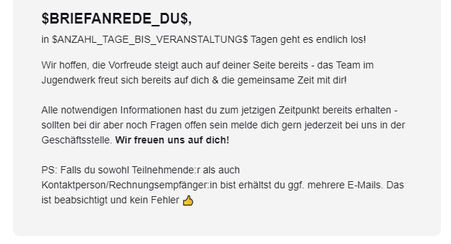

</details>

#### Neue Anmeldung

- Filter ⚙: `Teilnehmerart` ist `Teilnehmer`
- Anhänge 🔗:  [📄 Eingangsbestätigung Teilnehmende](#Anmeldung-TN-Eingangsbestaetigung)
- Bemerkung 💡: - / -

Betreff:

```
Eingangsbestätigung der Anmeldung für $VERANSTALTUNGSNAME$
```

E-Mail-Vorschautext:

```
$BRIEFANREDE_DU$, wir haben deine Anmeldung vom $ANMELDEDATUM_LANG$ zu „$VERANSTALTUNGSNAME$“ vom $VERANSTALTUNGSBEGINN_LANG$ bis $VERANSTALTUNGSENDE_LANG$ erhalten.
```

E-Mail-Text:

```
Eingangsbestätigung der Anmeldung für Angebotsnummer $ANGEBOTSNUMMER$: „$VERANSTALTUNGSNAME$“ in $VERANSTALTUNGSORT$
---
$BRIEFANREDE_DU$,
wir haben deine Anmeldung vom $ANMELDEDATUM_LANG$ zu „$VERANSTALTUNGSNAME$“ vom $VERANSTALTUNGSBEGINN_LANG$ bis $VERANSTALTUNGSENDE_LANG$ erhalten.

Anmeldungsnummer: $ANMELDUNGSNUMMER$

Dies ist eine Bestätigung über den Eingang der Anmeldung, keine verbindliche Anmeldebestätigung. Wir prüfen nun deine Anmeldung und melden uns so bald wie möglich bei dir. Eine Anmeldebestätigung folgt, sobald unsere Mitarbeitenden diese bearbeitet haben. Aufgrund hohen Anmeldeaufkommens kann das einige Tage in Anspruch nehmen. Wir bitten von telefonischen Anfragen des Anmeldestatus abzusehen, da dies unsere Bearbeitungszeit verlängert.

Falls du noch Fragen hast, melde dich gerne einfach per E-Mail oder rufe kurz bei uns an. Wir freuen uns auf eine tolle Zeit mit dir!

PS: Falls du sowohl Teilnehmende:r als auch Kontaktperson/Rechnungsempfänger:in bist erhältst du ggf. mehrere E-Mails. Das ist beabsichtigt und kein Fehler 👍 
```

<details>
  <summary>🖥 Vorschau</summary>
  
  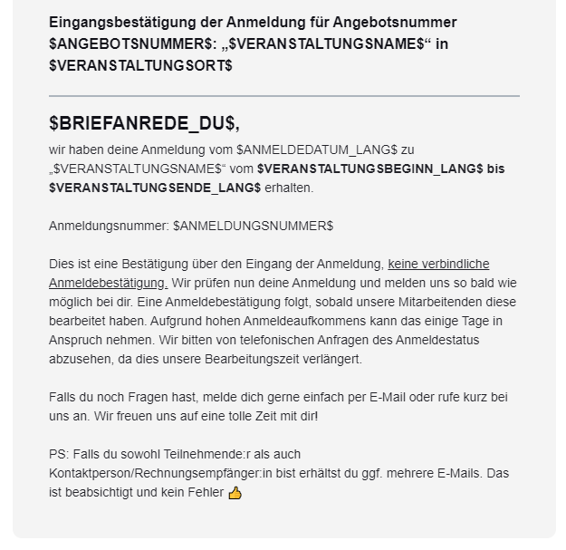

</details>

---

- Filter ⚙: `Teilnehmerart` ist `Betreuer`
- Anhänge 🔗: - / -
- Bemerkung 💡: - / -

Betreff:

```
Eingangsbestätigung der Mitarbeiter-Anmeldung für $VERANSTALTUNGSNAME$
```

E-Mail-Vorschautext:

```
$BRIEFANREDE_DU$, wir haben deine Mitarbeiter-Anmeldung vom $ANMELDEDATUM_LANG$ zu „$VERANSTALTUNGSNAME$“ vom $VERANSTALTUNGSBEGINN_LANG$ bis $VERANSTALTUNGSENDE_LANG$ erhalten.
```

E-Mail-Text:

```
Eingangsbestätigung der Mitarbeiter-Anmeldung für Angebotsnummer $ANGEBOTSNUMMER$: „$VERANSTALTUNGSNAME$“
---
$BRIEFANREDE_DU$,
wir haben deine Mitarbeiter-Anmeldung vom $ANMELDEDATUM_LANG$ Uhr zu „$VERANSTALTUNGSNAME$“ vom $VERANSTALTUNGSBEGINN_LANG$ bis $VERANSTALTUNGSENDE_LANG$ erhalten.

Anmeldungsnummer: $ANMELDUNGSNUMMER$
Betreuerfunktion/Team: $BETREUERFUNKTION$

Dies ist eine Bestätigung über den Eingang der Anmeldung, keine verbindliche Anmeldebestätigung. Wir prüfen nun deine Anmeldung und melden uns so bald wie möglich bei dir.

Falls du noch Fragen hast, melde dich gerne einfach per E-Mail oder rufe kurz bei uns an. Wir freuen uns auf eine tolle Zeit mit dir!

PS: Falls du sowohl Mitarbeitende:r als auch Kontaktperson bist erhältst du ggf. mehrere E-Mails. Das ist beabsichtigt und kein Fehler 👍 
```

<details>
  <summary>🖥 Vorschau</summary>
  
  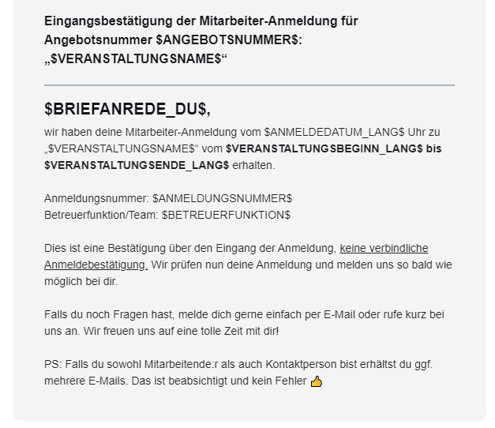

</details>

#### Ticketmail

- Bemerkung 💡: dafür haben wir aktuell noch keine Vorlage, da wir das Ticket-Feature bisher nicht genutzt haben!

### 🗓 Mails an Rechnungsempfänger / Kontaktperson einer Anmeldung

#### Neue Anmeldung

- Filter ⚙: `Anmeldungsart` ist `Anmeldung für Teilnehmende`
- Anhänge 🔗:  [📄 Eingangsbestätigung Rechnungsempfänger](#Anmeldung-RE-Eingangsbestaetigung)
- Bemerkung 💡: - / -

Betreff:

```
Eingangsbestätigung der Anmeldung für $VERANSTALTUNGSNAME$
```

E-Mail-Vorschautext:

```
$BRIEFANREDE_DU$, wir haben deine Anmeldung vom $ANMELDEDATUM_LANG$ zu „$VERANSTALTUNGSNAME$“ vom $VERANSTALTUNGSBEGINN_LANG$ bis $VERANSTALTUNGSENDE_LANG$ erhalten.
```

E-Mail-Text:

```
Eingangsbestätigung der Anmeldung für Angebotsnummer $ANGEBOTSNUMMER$: „$VERANSTALTUNGSNAME$“
---
$BRIEFANREDE_DU$,
wir haben (d)eine Anmeldung vom $ANMELDEDATUM_LANG$ $ANMELDEDATUM_UHRZEIT$ Uhr zu „$VERANSTALTUNGSNAME$“ in $VERANSTALTUNGSORT$ vom $VERANSTALTUNGSBEGINN_LANG$ bis $VERANSTALTUNGSENDE_LANG$ erhalten.

Anmeldungsnummer: $ANMELDUNGSNUMMER$
Angemeldete Teilnehmende: $NAMEN_DER_TEILNEHMENDEN$ ( Σ $ANZAHL_AN_TEILNEHMENDEN$ Teilnehmende)
Bemerkungen: $BEMERKUNGEN_DES_ANMELDENDEN$

Dies ist eine Bestätigung über den Eingang der Anmeldung, keine verbindliche Anmeldebestätigung. Wir prüfen nun deine Anmeldung und melden uns so bald wie möglich bei dir. Eine Anmeldebestätigung folgt, sobald unsere Mitarbeitenden diese bearbeitet haben. Aufgrund hohen Anmeldeaufkommens kann das einige Tage in Anspruch nehmen. Wir bitten von telefonischen Anfragen des Anmeldestatus abzusehen, da dies unsere Bearbeitungszeit verlängert.

Falls du noch Fragen hast, melde dich gerne einfach per E-Mail oder rufe kurz bei uns an. Wir freuen uns auf eine tolle Zeit mit dir!

PS: Falls du sowohl Teilnehmende:r als auch Kontaktperson/Rechnungsempfänger:in bist erhältst du ggf. mehrere E-Mails. Das ist beabsichtigt und kein Fehler 👍 
```

<details>
  <summary>🖥 Vorschau</summary>
  
  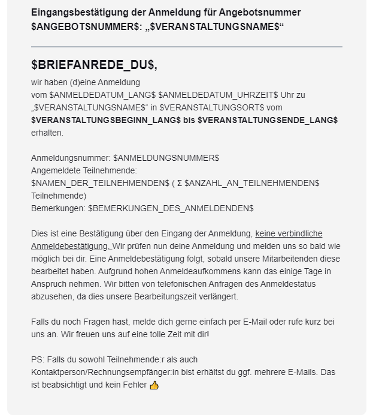

</details>

---

- Filter ⚙: `Anmeldungsart` ist `Anmeldung für Betreuende`
- Anhänge 🔗: - / -
- Bemerkung 💡: - / -

Betreff:

```
Eingangsbestätigung der Mitarbeiter-Anmeldung für $VERANSTALTUNGSNAME$
```

E-Mail-Vorschautext:

```
$BRIEFANREDE_DU$, wir haben deine Mitarbeiter-Anmeldung vom $ANMELDEDATUM_LANG$ zu „$VERANSTALTUNGSNAME$“ vom $VERANSTALTUNGSBEGINN_LANG$ bis $VERANSTALTUNGSENDE_LANG$ erhalten.
```

E-Mail-Text:

```
Eingangsbestätigung der Mitarbeiter-Anmeldung für Angebotsnummer $ANGEBOTSNUMMER$: „$VERANSTALTUNGSNAME$“
---
$BRIEFANREDE_DU$,
wir haben deine Mitarbeiter-Anmeldung vom $ANMELDEDATUM_LANG$ zu „$VERANSTALTUNGSNAME$“ in $VERANSTALTUNGSORT$ vom $VERANSTALTUNGSBEGINN_LANG$ bis $VERANSTALTUNGSENDE_LANG$ erhalten.

Anmeldungsnummer: $ANMELDUNGSNUMMER$
Angemeldete Mitarbeitende: $NAMEN_DER_TEILNEHMENDEN$ ( Σ $ANZAHL_AN_TEILNEHMENDEN$ Mitarbeitende)

Dies ist eine Bestätigung über den Eingang der Anmeldung, keine verbindliche Anmeldebestätigung. Wir prüfen nun deine Anmeldung und melden uns so bald wie möglich bei dir.

Falls du noch Fragen hast, melde dich gerne einfach per E-Mail oder rufe kurz bei uns an. Wir freuen uns auf eine tolle Zeit mit dir!

PS: Falls du sowohl Mitarbeitende:r als auch Kontaktperson bist erhältst du ggf. mehrere E-Mails. Das ist beabsichtigt und kein Fehler 👍 
```

<details>
  <summary>🖥 Vorschau</summary>
  
  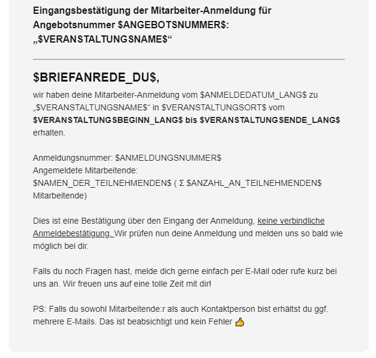

</details>

#### Anmeldung bestätigt

- Filter ⚙: `Anmeldungsart` ist `Anmeldung für Teilnehmende`
- Anhänge 🔗:  [📄 Anmeldebestätigung Rechnungsempfänger (mit Anzahlung)](#Anmeldebestaetigung-RE-mit-Anzahlung)
- Bemerkung 💡: - / -

Betreff:

```
Anmeldebestätigung für $VERANSTALTUNGSNAME$
```

E-Mail-Vorschautext:

```
$BRIEFANREDE_DU$, herzlichen Glückwunsch, du bist dabei!
```

E-Mail-Text:

```
Bestätigung der Anmeldung für $NAMEN_DER_TEILNEHMENDEN$: Angebotsnummer $ANGEBOTSNUMMER$: „$VERANSTALTUNGSNAME$“ in $VERANSTALTUNGSORT$
---
$BRIEFANREDE_DU$,
wir haben (d)eine Anmeldung zu „$VERANSTALTUNGSNAME$“ in $VERANSTALTUNGSORT$ vom $VERANSTALTUNGSBEGINN_LANG$ bis $VERANSTALTUNGSENDE_LANG$ erhalten und bestätigen hiermit die Teilnahme von $NAMEN_DER_TEILNEHMENDEN$. Herzlichen Glückwunsch! 

Damit ist gemäß unseren Reisebedingungen der Reisevertrag zustande gekommen. Anbei findest du die ausführliche Anmeldebestätigung sowie weitere, wichtige Hinweise. Bitte lies dir diese aufmerksam durch.

Die beiden Rechnungen für die Freizeit (1x Anzahlung, 1x Restbetrag) erhältst du gesondert von dieser Bestätigung. Bitte beachte hierbei das Zahlungsziel der Anzahlung.

Spätestens drei Wochen vor Beginn der Freizeit bekommst du einen
ausführlichen Informationsbrief. Für weitere Fragen stehen wir natürlich
gerne zur Verfügung. In $ANZAHL_TAGE_BIS_VERANSTALTUNG$ Tagen geht’s los!

PS: Falls du sowohl Teilnehmende:r als auch Kontaktperson/Rechnungsempfänger:in bist erhältst du ggf. mehrere E-Mails. Das ist beabsichtigt und kein Fehler 👍 
```

<details>
  <summary>🖥 Vorschau</summary>
  
  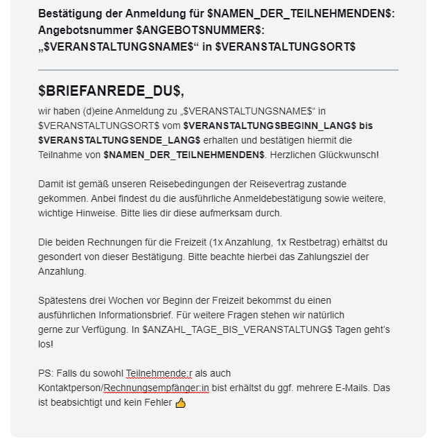

</details>

---

- Filter ⚙: `Anmeldungsart` ist `Anmeldung für Betreuende`
- Anhänge 🔗:  - / -
- Bemerkung 💡: - / -

Betreff:

```
Anmeldebestätigung für $VERANSTALTUNGSNAME$
```

E-Mail-Vorschautext:

```
$BRIEFANREDE_DU$, herzlichen Glückwunsch, du bist dabei!
```

E-Mail-Text:

```
Bestätigung der Mitarbeiter-Anmeldung von $NAMEN_DER_TEILNEHMENDEN$: Angebotsnummer $ANGEBOTSNUMMER$: „$VERANSTALTUNGSNAME$“
---
$BRIEFANREDE_DU$,
herzlichen Glückwunsch, du bist als Mitarbeiter dabei! Wir sind sehr dankbar, dass du uns unterstützt!

Wir haben deine Anmeldung zu „$VERANSTALTUNGSNAME$“ vom $VERANSTALTUNGSBEGINN_LANG$ bis $VERANSTALTUNGSENDE_LANG$ erhalten und bestätigen hiermit die Teilnahme.

Weitere Informationen zum Ablauf und der Vorbereitung erhältst du in der Regel direkt von der Freizeitleitung. Für weitere Fragen stehen wir natürlich
gerne zur Verfügung. In $ANZAHL_TAGE_BIS_VERANSTALTUNG$ Tagen geht’s los!

PS: Falls du sowohl Mitarbeitende:r als auch Kontaktperson bist erhältst du ggf. mehrere E-Mails. Das ist beabsichtigt und kein Fehler 👍 

```

<details>
  <summary>🖥 Vorschau</summary>
  
  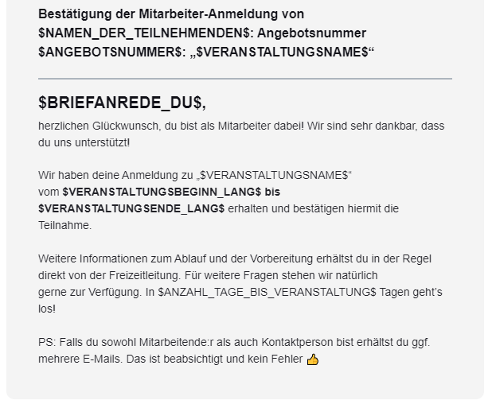

</details>

#### Neue Gruppenanmeldung erstellt

- Filter ⚙: - / -
- Anhänge 🔗:  [📄 Anmeldebestätigung TN mit Anzahlung](#Anmeldebestaetigung-TN-mit-Anzahlung)
- Bemerkung 💡: Hier kann keine persönliche Anrede verwendet werden, da der Platzhalter hier nicht verfügbar ist.

Betreff:

```
Neue Gruppenanmeldung für $VERANSTALTUNGSNAME$ erstellt
```

E-Mail-Vorschautext:

```
Hey, wir haben die Gruppenanmeldung zu „$VERANSTALTUNGSNAME$“ vom $VERANSTALTUNGSBEGINN_LANG$ bis $VERANSTALTUNGSENDE_LANG$ erhalten.
```

E-Mail-Text:

```
Neue Gruppenanmeldung für $ANGEBOTSNUMMER$: „$VERANSTALTUNGSNAME$“ in $VERANSTALTUNGSORT$ erstellt
---
Hey,
wir haben die Gruppenanmeldung zu „$VERANSTALTUNGSNAME$“ in $VERANSTALTUNGSORT$
vom $VERANSTALTUNGSBEGINN_LANG$ bis $VERANSTALTUNGSENDE_LANG$ erhalten.

Anmeldungsnummer: $ANMELDUNGSNUMMER$

Diesen Link bitte nicht an deine Gruppenteilnehmenden weitergeben. Über diesen Link kannst du die Anmeldungen deiner Gruppenteilnehmenden überprüfen und bestätigen. Wenn alle Anmeldungen eingegangen sind kannst du darüber die Anmeldung schließen und abschicken.

Diesen Link kannst du an deine Gruppenteilnehmenden weiterleiten. Diese können sich dann zu Deiner Gruppe anmelden.

Wir prüfen die angemeldeten Teilnehmer deiner Gruppenanmeldung erst, nachdem du diese abgeschlossen und abgeschickt hast und melden uns so bald wie möglich bei dir.

Falls du noch Fragen hast, melde dich gerne einfach per E-Mail oder rufe kurz bei uns an. Wir freuen uns auf eine tolle Zeit mit dir!
```

💡 Code-Block Buttons inkl. Text (2-spaltiger Absatz)

```
<re-grid>
    <re-column padding="0 0 20px 0" width="50%" valign="top">
        <re-button background-color="#123a5e" font-size="16px" href="$GRUPPENLINK_VERANTWORTLICHE_PERSON$">
            Verwaltung der&nbsp; Anmeldungen
        </re-button>
        <re-spacer></re-spacer>
        <re-text>
            Diesen Link bitte&nbsp;<u>nicht</u>&nbsp;an deine Gruppenteilnehmenden weitergeben. Über diesen Link kannst du die Anmeldungen deiner Gruppenteilnehmenden überprüfen und bestätigen. Wenn alle Anmeldungen eingegangen sind kannst du darüber die Anmeldung schließen und abschicken.
        </re-text>
    </re-column>
    <re-column-spacer></re-column-spacer>
    <re-column padding="0 0 20px 0" width="50%" valign="top">
        <re-button color="#ffffff" background-color="#f29400" font-size="16px" href="$GRUPPENLINK_TEILNEHMENDE$">
            Anmeldelink für Teilnehmende
        </re-button>
        <re-spacer></re-spacer>
        <re-text>
            Diesen Link kannst du an deine Gruppenteilnehmenden weiterleiten. Diese können sich dann zu Deiner Gruppe anmelden.
        </re-text>
    </re-column>
</re-grid>
```

<details>
  <summary>🖥 Vorschau</summary>
  
  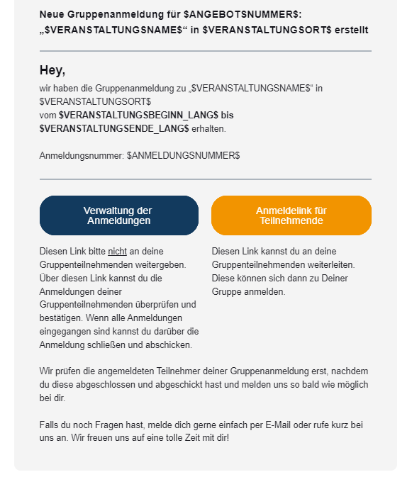

</details>

### 🗓 Rechnungsmails an den Rechnungsempfänger einer Anmeldung

_Diese Vorlagen werden für alle Rechnungen verwendet, welche aus einer Anmeldung erzeugt wurden, oder für Rechnungen bei denen eine Anmeldung händisch hinterlegt wurde._

#### Rechnung versenden

Filter, Anhänge und Hinweise:

- Filter ⚙: `ist Anzahlung` ist `Nein`
- Anhänge 🔗:  [📄 Rechnung für Angebot (ohne Anzahlung)](#Rechnung-Angebot-ohne-Anzahlung)
- Bemerkung 💡: - / -

Betreff:

```
Rechnung für die Teilnahme an $VERANSTALTUNGSNAME$ ($ANGEBOTSNUMMER$ - $RECHNUNGSNUMMER$)
```

E-Mail-Vorschautext:

```
$BRIEFANREDE_DU$, anbei findest du die Rechnung für die Teilnahme an „$VERANSTALTUNGSNAME$“ vom $VERANSTALTUNGSBEGINN_LANG$ bis $VERANSTALTUNGSENDE_LANG$.
```

E-Mail-Text:

```
Rechnung für die Teilnahme am Angebot $ANGEBOTSNUMMER$: „$VERANSTALTUNGSNAME$“ in $VERANSTALTUNGSORT$
---
$BRIEFANREDE_DU$,
anbei findest du die Rechnung für die Teilnahme an „$VERANSTALTUNGSNAME$“ vom $VERANSTALTUNGSBEGINN_LANG$ bis $VERANSTALTUNGSENDE_LANG$ .

Wir bitten, den fälligen Restbetrag von $RESTBETRAG$ bis zum $FORMATIERTES_ZAHLUNGSZIEL$ auf das folgende Konto zu überweisen:

IBAN: $IBAN_DES_ZIELKONTOS$
BIC: BIC12456
Kontoinhaber: Deine Organisation
Verwendungszweck: $VERWENDUNGSZWECK$

Spätestens drei Wochen vor Beginn der Freizeit bekommst du einen ausführlichen Informationsbrief. Für weitere Fragen stehen wir natürlich gerne zur Verfügung.
```

<details>
  <summary>🖥 Vorschau</summary>
  
  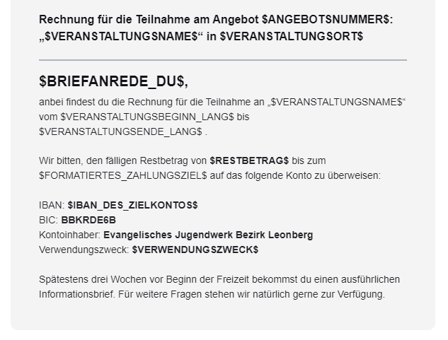

</details>

---

Filter, Anhänge und Hinweise:

- Filter ⚙: `ist Anzahlung` ist `Ja`
- Anhänge 🔗:  [📄 Rechnung für Angebot (mit Anzahlung)](#Rechnung-Angebot-mit-Anzahlung)
- Bemerkung 💡: - / -

Betreff:

```
Anzahlungsrechnung für die Teilnahme an $VERANSTALTUNGSNAME$ ($ANGEBOTSNUMMER$ - $RECHNUNGSNUMMER$)
```

E-Mail-Vorschautext:

```
$BRIEFANREDE_DU$, anbei findest du die Anzahlungsrechnung für die Teilnahme an „$VERANSTALTUNGSNAME$“ vom $FORMATIERTER_VERANSTALTUNGSBEGINN$ bis $FORMATIERTES_VERANSTALTUNGSENDE$.
```

E-Mail-Text:

```
Rechnung für die Teilnahme am Angebot $ANGEBOTSNUMMER$: „$VERANSTALTUNGSNAME$“ in $VERANSTALTUNGSORT$
---
$BRIEFANREDE_DU$,
anbei findest du die Rechnung für die Teilnahme an „$VERANSTALTUNGSNAME$“ vom $FORMATIERTER_VERANSTALTUNGSBEGINN$ bis $FORMATIERTES_VERANSTALTUNGSENDE$.

Wir bitten, die Anzahlung von $RESTBETRAG$ bis zum $ZAHLUNGSZIEL$ auf das folgende Konto zu überweisen:

IBAN: $IBAN_DES_ZIELKONTOS$
BIC: BIC12456
Kontoinhaber: Deine Organisation
Verwendungszweck: $VERWENDUNGSZWECK$

Der Restbetrag ist bis spätestens zwei Wochen vor Beginn der Freizeit am $VERANSTALTUNGSBEGINN$ fällig, hierfür erhältst du eine separate Rechnung.

Spätestens drei Wochen vor Beginn der Freizeit bekommst du einen ausführlichen Informationsbrief. Für weitere Fragen stehen wir natürlich gerne zur Verfügung.
```

<details>
  <summary>🖥 Vorschau</summary>
  
  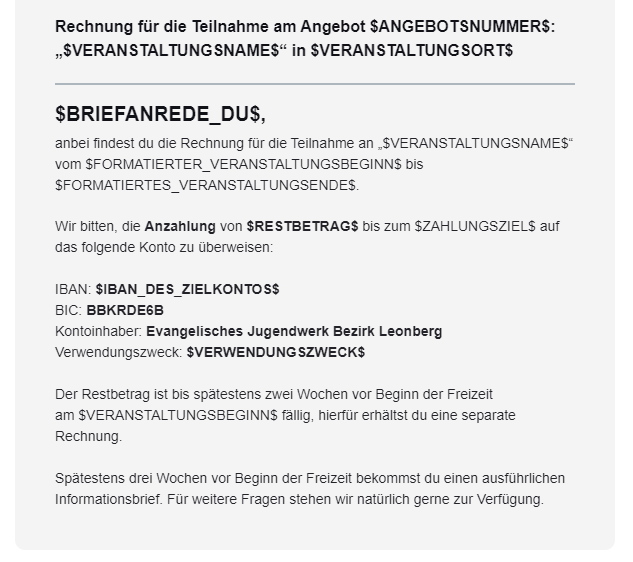

</details>

---

#### Zahlungserinnerung / Mahnung versenden

Filter, Anhänge und Hinweise:

- Filter ⚙: - / -
- Anhänge 🔗:  - / -
- Bemerkung 💡: - / -

Betreff:

```
Zahlungserinnerung - Rechnung für die Teilnahme an $VERANSTALTUNGSNAME$ ($ANGEBOTSNUMMER$ - $RECHNUNGSNUMMER$)
```

E-Mail-Vorschautext:

```
$BRIEFANREDE_DU$, wir haben bisher leider noch keinen Zahlungseingang feststellen können. Wir sind uns sicher, dass dies nur ein Versehen war und bitten dich daher den ausstehenden Restbetrag in den nächsten Tagen zu überweisen.
```

E-Mail-Text:

```
Zahlungserinnerung an die Rechnung für die Teilnahme am Angebot $ANGEBOTSNUMMER$: „$VERANSTALTUNGSNAME$“ in $VERANSTALTUNGSORT$
---
$BRIEFANREDE_DU$,
wir haben bisher für die unten aufgeführte Rechnung leider noch keinen Zahlungseingang feststellen können. Wir sind uns sicher, dass dies nur ein Versehen war und bitten dich daher den ausstehenden Restbetrag in den nächsten Tagen auf das genannte Konto zu überweisen:

IBAN: $IBAN_DES_ZIELKONTOS$
BIC: BIC12456
Kontoinhaber: Deine Organisation
Verwendungszweck: $VERWENDUNGSZWECK$

Rechnungsnummer: $RECHNUNGSNUMMER$
Rechnungsdatum: $RECHNUNGSDATUM_LANG$
bereits bezahlter Betrag: $BEREITS_BEZAHLTER_BETRAG$
Zahlungsziel: $ZAHLUNGSZIEL_LANG$
letzte Zahlung: $DATUM_LETZTE_ZAHLUNG_LANG$
fälliger Restbetrag: $RESTBETRAG$

Solltest du den fälligen Betrag in den letzten Tagen bereits überwiesen haben kannst du diese Benachrichtigung ignorieren.
```

<details>
  <summary>🖥 Vorschau</summary>
  
  

</details>

### Mails an die Sachbearbeitung einer Veranstaltung

#### Neue Anmeldung

Filter, Anhänge und Hinweise:

- Filter ⚙: `Anmeldungsart` ist `Anmeldung für Betreuende`
- Anhänge 🔗: - / -
- Bemerkung 💡: Im Button wird automatisch via Platzhalter ein Link erzeugt, der zur jeweiligen Seite führt 🎉

Betreff:

```
Neue Mitarbeiter-Anmeldung für $ANGEBOTSNUMMER$: "$VERANSTALTUNGSNAME$" (A-$ANMELDUNGSNUMMER$, $ANZAHL_AN_TEILNEHMENDEN$ MA)
```

E-Mail-Vorschautext:

```
Hallo $SACHBEARBEITUNG_VORNAME$, am $ANMELDEDATUM_UHRZEIT$ Uhr ging eine neue Mitarbeiter-Anmeldung für $ANGEBOTSNUMMER$: „$VERANSTALTUNGSNAME$“ ein: $NAMEN_DER_TEILNEHMENDEN$ ( Σ $ANZAHL_AN_TEILNEHMENDEN$ Mitarbeitende)
```

E-Mail-Text:

```
Benachrichtigung über den Eingang einer Mitarbeiter-Anmeldung für $ANGEBOTSNUMMER$: „$VERANSTALTUNGSNAME$“
---
Hallo $SACHBEARBEITUNG_VORNAME$,

am $ANMELDEDATUM$ ging eine neue Mitarbeiter-Anmeldung für $ANGEBOTSNUMMER$: „$VERANSTALTUNGSNAME$“ ein:

Anmeldungsnummer: $ANMELDUNGSNUMMER$
Angemeldete Mitarbeitende: $NAMEN_DER_TEILNEHMENDEN$ ( Σ $ANZAHL_AN_TEILNEHMENDEN$ Mitarbeitende)
Bemerkungen: $BEMERKUNGEN_DES_ANMELDENDEN$
```

<details>
  <summary>🖥 Vorschau</summary>
  
  

</details>

---

Filter, Anhänge und Hinweise:

- Filter ⚙: `Anmeldungsart` ist `Anmeldung für Teilnehmende`
- Anhänge 🔗:  - / -
- Bemerkung 💡: Im Button wird automatisch via Platzhalter ein Link erzeugt, der zur jeweiligen Seite führt 🎉

Betreff:

```
Neue Anmeldung für $ANGEBOTSNUMMER$: "$VERANSTALTUNGSNAME$" (A-$ANMELDUNGSNUMMER$, $ANZAHL_AN_TEILNEHMENDEN$ TN)
```

E-Mail-Vorschautext:

```
Hallo $SACHBEARBEITUNG_VORNAME$, am $ANMELDEDATUM_LANG$ ging eine neue Anmeldung für $ANGEBOTSNUMMER$: „$VERANSTALTUNGSNAME$“ ein: $NAMEN_DER_TEILNEHMENDEN$ ( Σ $ANZAHL_AN_TEILNEHMENDEN$ Teilnehmende)
```

E-Mail-Text:

```
Benachrichtigung über den Eingang einer Anmeldung für $ANGEBOTSNUMMER$: „$VERANSTALTUNGSNAME$“
---
Hallo $SACHBEARBEITUNG_VORNAME$,

am $ANMELDEDATUM_UHRZEIT$ ging eine neue Anmeldung für $ANGEBOTSNUMMER$: „$VERANSTALTUNGSNAME$“ ein:

Anmeldungsnummer: $ANMELDUNGSNUMMER$
Angemeldete Teilnehmende: $NAMEN_DER_TEILNEHMENDEN$ ( Σ $ANZAHL_AN_TEILNEHMENDEN$ Teilnehmende)
Bemerkungen: $BEMERKUNGEN_DES_ANMELDENDEN$
```

💡 Der Button-Abschnitt hat folgenden Code:

```
<re-grid>
    <re-column padding="0 0 20px 0" width="50%">
        <re-button font-size="16px" background-color="#068b65" href="https://ejwleo.amosweb.de/app/events/registration/$ANMELDUNGSNUMMER$/registrationOverview">
            <b>zur Anmeldung</b> 📧
        </re-button>
    </re-column>
    <re-column-spacer></re-column-spacer>
    <re-column padding="0 0 20px 0" width="50%">
        <re-button font-size="16px" background-color="#09be8b" href="https://ejwleo.amosweb.de/app/events/$VERANSTALTUNGS_ID$/eventOverview">
            <b>zur Veranstaltung 🔗</b>
        </re-button>
    </re-column>
</re-grid>
```

<details>
  <summary>🖥 Vorschau</summary>
  
  

</details>

### 🗓 Mails an die Veranstaltungsleitungen

_Veranstaltungsleitungen können über einen Freigabelink Zugriff auf Teilnehmerlisten bekommen._

#### Freigabelink senden

Filter, Anhänge und Hinweise:

- Filter ⚙: - / -
- Anhänge 🔗:  [📄 Anmeldebestätigung TN mit Anzahlung](#Anmeldebestaetigung-TN-mit-Anzahlung)
- Bemerkung 💡: - / -

Betreff:

```
Neue Leitungsfreigabe für $ANGEBOTSNUMMER$: "$VERANSTALTUNGSNAME$" (vertraulich)
```

E-Mail-Vorschautext:

```
Neue Freigabe für externe Veranstaltungsleitung für  $ANGEBOTSNUMMER$: „$VERANSTALTUNGSNAME$“ verfügbar
```

E-Mail-Text:

```
Neue Freigabe für externe Veranstaltungsleitung für  $ANGEBOTSNUMMER$: „$VERANSTALTUNGSNAME$“ verfügbar
---
Hallo $BRIEFANREDE_DU$,

in deiner Rolle als externe Veranstaltungsleitung für $VERANSTALTUNGSNAME$ ($ANGEBOTSNUMMER$) erhältst du über diese Freigabe den Zugang zu den veranstaltungsbezogenen AMOS-Daten im DEINE ORGANISATION.

Die Freigabe wurde für dich mit folgenden Daten hinterlegt:
E-Mail-Adresse: $E-MAIL$
Telefonnummer: $MOBIL$

Über den Button unten kommst du zur Web-Ansicht. Dort kannst du einen Zugangscode per SMS an deine Telefonnummer anfordern. Nach dessen Eingabe kannst du die Anmeldungen - und Teilnahme der Veranstaltung einsehen und Exporte (bspw. Teilnehmerlisten etc) generieren.

⚠ Die dort verfügbaren Daten sind vertraulich und dürfen in keinem Fall an externe weitergegeben oder diesen zugänglich gemacht werden. Exporte dürfen nur temporär gespeichert werden und müssen nach Abschluss der Veranstaltung Datenschutzkonform vernichtet werden! Wende dich bei Fragen hierzu gerne jederzeit an das Team der Geschäftsstelle.

```

💡 Der Button hat folgenden Code:

```
<re-button href="$FREIGABELINK$" background-color="#09be8b">
    <b>zur Web-Ansicht🔗</b>
</re-button>
```

<details>
  <summary>🖥 Vorschau</summary>
  
  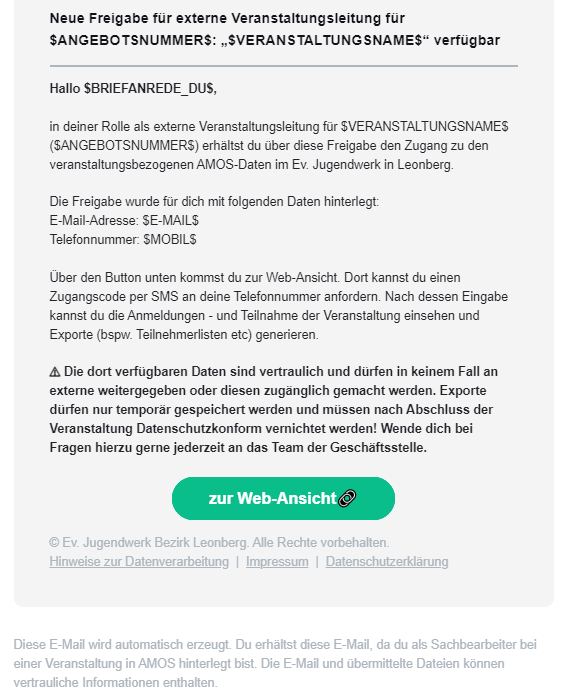

</details>

### 💵 Rechnungsmails an den Rechnungsempfänger einer Rechnung

_Diese Vorlagen werden für alle Rechnungen verwendet, welche keine Verknüpfung zu einer Anmeldung haben._

#### Rechnung versenden

Filter, Anhänge und Hinweise:

- Filter ⚙: - / -
- Anhänge 🔗:  [📄 Rechnung Allgemein](#Rechnung-Allgemein)
- Bemerkung 💡: - / -

Betreff:

```
Rechnung $RECHNUNGSNUMMER$ - deine Organisation
```

E-Mail-Vorschautext:

```
$BRIEFANREDE_DU$, anbei findest du die Rechnung (Nr. $RECHNUNGSNUMMER$)
```

E-Mail-Text:

```
Rechnung Nr. $RECHNUNGSNUMMER$
---
$BRIEFANREDE_DU$,
anbei findest du die Rechnung. 

Wir bitten, den fälligen Restbetrag von $RESTBETRAG$ bis zum $ZAHLUNGSZIEL_LANG$ auf das folgende Konto zu überweisen:

IBAN: $IBAN_DES_ZIELKONTOS$
BIC: BIC12346789
Kontoinhaber: Deine Organisation
Verwendungszweck: $VERWENDUNGSZWECK$

Falls du noch Fragen hast, melde dich gerne in der Geschäftsstelle per E-Mail oder rufe uns an.
```

<details>
  <summary>🖥 Vorschau</summary>
  
  

</details>

#### Zahlungserinnerung / Mahnung versenden

Filter, Anhänge und Hinweise:

- Filter ⚙: - / -
- Anhänge 🔗: - / -
- Bemerkung 💡: - / -

Betreff:

```
Zahlungserinnerung - Rechnung $RECHNUNGSNUMMER$ - deine Organisation
```

E-Mail-Vorschautext:

```
Zahlungserinnerung an die Rechnung Nr. $RECHNUNGSNUMMER$ vom $RECHNUNGSDATUM_LANG$
```

E-Mail-Text:

```
Zahlungserinnerung an die Rechnung Nr. $RECHNUNGSNUMMER$ vom $RECHNUNGSDATUM_LANG$
---
$BRIEFANREDE_DU$,
wir haben bisher für die unten aufgeführte Rechnung leider noch keinen Zahlungseingang feststellen können. Wir sind uns sicher, dass dies nur ein Versehen war und bitten dich daher den ausstehenden Restbetrag in den nächsten Tagen auf das genannte Konto zu überweisen:

IBAN: $IBAN_DES_ZIELKONTOS$
BIC: BIC12456
Kontoinhaber: Deine Organisation
Verwendungszweck: $VERWENDUNGSZWECK$

Rechnungsnummer: $RECHNUNGSNUMMER$
Rechnungsdatum: $RECHNUNGSDATUM_LANG$
bereits bezahlter Betrag: $BEREITS_BEZAHLTER_BETRAG$
Zahlungsziel: $ZAHLUNGSZIEL_LANG$
letzte Zahlung: $DATUM_LETZTE_ZAHLUNG_LANG$
fälliger Restbetrag: $RESTBETRAG$

Solltest du den fälligen Betrag in den letzten Tagen bereits überwiesen haben kannst du diese Benachrichtigung ignorieren.
```

<details>
  <summary>🖥 Vorschau</summary>
  
  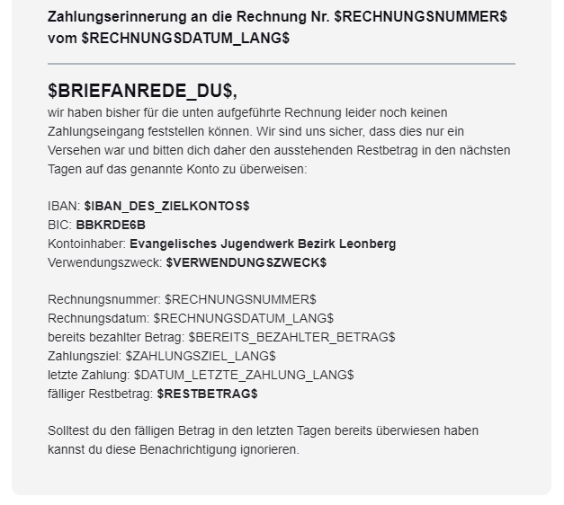

</details>

## Dokument-Vorlagen

⏲ _coming soon_ 😊

> Hinweis: Die folgenden Überschriften dienen übergangsweise (bis zur Bereitstellung der Dokumentvorlagen) dazu, die Verlinkungen in den E-Mail-Vorlagen einbetten zu können.

---

### Vorlagen für Teilnehmende und Betreuende

<a id="Anmeldebestaetigung-TN-mit-Anzahlung"></a>
#### Anmeldebestätigung Teilnehmende (mit Anzahlung)

➡⏲ ...

<a id="Anmeldebestaetigung-TN-ohne-Anzahlung"></a>
#### Anmeldebestätigung Teilnehmende (ohne Anzahlung)

➡⏲ ...

<a id="Anmeldung-TN-Eingangsbestaetigung"></a>
#### Eingangsbestätigung Teilnehmende

➡⏲ ...

<a id="Anmeldung-TN-Information-Wartenliste"></a>
#### Information über Warteliste

➡⏲ ...

---

### Vorlagen für Anmeldungen

<a id="Anmeldung-RE-Eingangsbestaetigung"></a>
#### Eingangsbestätigung Rechnungsempfänger

➡⏲ ...
<a id="Anmeldebestaetigung-RE-mit-Anzahlung"></a>
#### Anmeldebestätigung Rechnungsempfänger (mit Anzahlung)

➡⏲ ...

<a id="Anmeldebestaetigung-RE-ohne-Anzahlung"></a>
#### Anmeldebestätigung Rechnungsempfänger (ohne Anzahlung)

➡⏲ ...

---

### Vorlagen für Rechnungen

<a id="Rechnung-Angebot-mit-Anzahlung"></a>
#### Rechnung für Angebot (mit Anzahlung)

➡⏲ ...

<a id="Rechnung-Angebot-ohne-Anzahlung"></a>
#### Rechnung für Angebot (ohne Anzahlung)

➡⏲ ...

<a id="Rechnung-Angebot-Storno"></a>
#### Rechnung für Angebot Stornierung

➡⏲ ...

<a id="Rechnung-Allgemein"></a>
#### Allgemeine Rechnung

➡⏲ ...

<p align="right">(<a href="#readme-top">🔼 zurück nach Oben</a>)</p>

## FAQ

Falls zu den Vorlagen Fragen auftauchen werden wir diese hier laufend ergänzen.

### Wie können wir uns revanchieren?

Ein persönliches Danke - ob auf dem Konvent, per Mail oder Instagram freut uns immer, genauso wie Feedback und Tipps dazu. Wenn ihr euch darüber hinaus noch erkenntlich zeigen möchtet freut sich unser Förderverein immer gern über Spenden - **jeder Euro zählt** ➡ [Förderverein des Ev. Jugendwerks Bezirk Leonberg](https://ejwleo.de/foerderverein/)

<p align="right">(<a href="#readme-top">🔼 zurück nach Oben</a>)</p>
