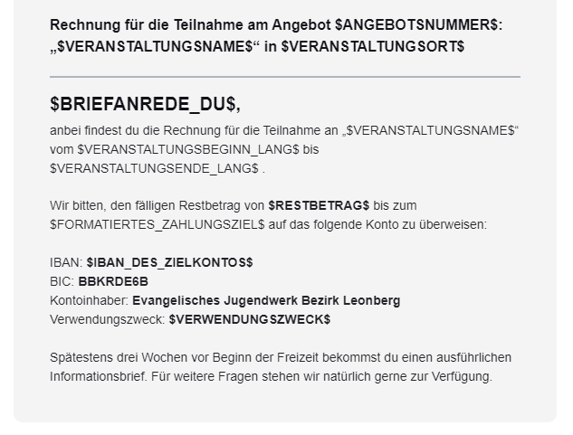
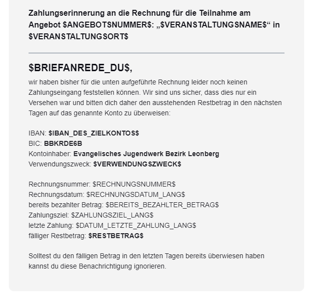
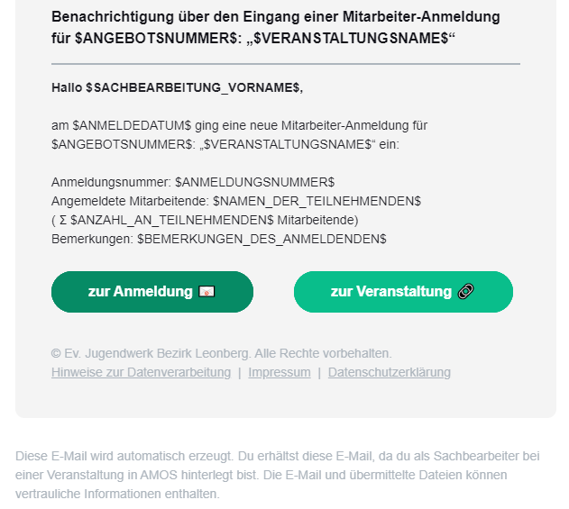
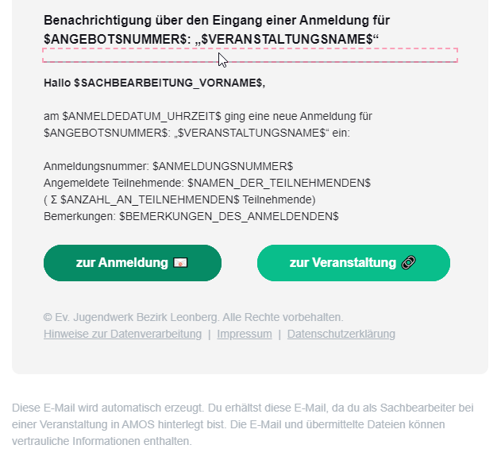
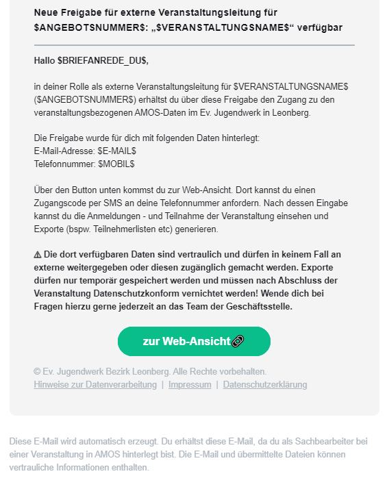

_Legende:_ 🗓 Veranstaltungsmails (im Kontext einer Veranstaltung) 💵 allgemein Rechnungsmails

## 🗓 Rechnungsmails an den Rechnungsempfänger einer Anmeldung

_Diese Vorlagen werden für alle Rechnungen verwendet, welche aus einer Anmeldung erzeugt wurden, oder für Rechnungen bei denen eine Anmeldung händisch hinterlegt wurde._

### Rechnung versenden

Filter, Anhänge und Hinweise:

- Filter ⚙: `ist Anzahlung` ist `Nein`
- Anhänge 🔗:  [📄 Rechnung für Angebot (ohne Anzahlung)](/docs/dokument-vorlagen/#Rechnung-Angebot-ohne-Anzahlung)
- Bemerkung 💡: - / -

Betreff:

```
Rechnung für die Teilnahme an $VERANSTALTUNGSNAME$ ($ANGEBOTSNUMMER$ - $RECHNUNGSNUMMER$)
```

E-Mail-Vorschautext:

```
$BRIEFANREDE_DU$, anbei findest du die Rechnung für die Teilnahme an „$VERANSTALTUNGSNAME$“ vom $VERANSTALTUNGSBEGINN_LANG$ bis $VERANSTALTUNGSENDE_LANG$.
```

E-Mail-Text:

```
Rechnung für die Teilnahme am Angebot $ANGEBOTSNUMMER$: „$VERANSTALTUNGSNAME$“ in $VERANSTALTUNGSORT$
---
$BRIEFANREDE_DU$,
anbei findest du die Rechnung für die Teilnahme an „$VERANSTALTUNGSNAME$“ vom $VERANSTALTUNGSBEGINN_LANG$ bis $VERANSTALTUNGSENDE_LANG$ .

Wir bitten, den fälligen Restbetrag von $RESTBETRAG$ bis zum $FORMATIERTES_ZAHLUNGSZIEL$ auf das folgende Konto zu überweisen:

IBAN: $IBAN_DES_ZIELKONTOS$
BIC: BIC12456
Kontoinhaber: Deine Organisation
Verwendungszweck: $VERWENDUNGSZWECK$

Spätestens drei Wochen vor Beginn der Freizeit bekommst du einen ausführlichen Informationsbrief. Für weitere Fragen stehen wir natürlich gerne zur Verfügung.
```

<details>
  <summary>🖥 Vorschau</summary>
  
  

</details>

---

Filter, Anhänge und Hinweise:

- Filter ⚙: `ist Anzahlung` ist `Ja`
- Anhänge 🔗:  [📄 Rechnung für Angebot (mit Anzahlung)](/docs/dokument-vorlagen/#Rechnung-Angebot-mit-Anzahlung)
- Bemerkung 💡: - / -

Betreff:

```
Anzahlungsrechnung für die Teilnahme an $VERANSTALTUNGSNAME$ ($ANGEBOTSNUMMER$ - $RECHNUNGSNUMMER$)
```

E-Mail-Vorschautext:

```
$BRIEFANREDE_DU$, anbei findest du die Anzahlungsrechnung für die Teilnahme an „$VERANSTALTUNGSNAME$“ vom $FORMATIERTER_VERANSTALTUNGSBEGINN$ bis $FORMATIERTES_VERANSTALTUNGSENDE$.
```

E-Mail-Text:

```
Rechnung für die Teilnahme am Angebot $ANGEBOTSNUMMER$: „$VERANSTALTUNGSNAME$“ in $VERANSTALTUNGSORT$
---
$BRIEFANREDE_DU$,
anbei findest du die Rechnung für die Teilnahme an „$VERANSTALTUNGSNAME$“ vom $FORMATIERTER_VERANSTALTUNGSBEGINN$ bis $FORMATIERTES_VERANSTALTUNGSENDE$.

Wir bitten, die Anzahlung von $RESTBETRAG$ bis zum $ZAHLUNGSZIEL$ auf das folgende Konto zu überweisen:

IBAN: $IBAN_DES_ZIELKONTOS$
BIC: BIC12456
Kontoinhaber: Deine Organisation
Verwendungszweck: $VERWENDUNGSZWECK$

Der Restbetrag ist bis spätestens zwei Wochen vor Beginn der Freizeit am $VERANSTALTUNGSBEGINN$ fällig, hierfür erhältst du eine separate Rechnung.

Spätestens drei Wochen vor Beginn der Freizeit bekommst du einen ausführlichen Informationsbrief. Für weitere Fragen stehen wir natürlich gerne zur Verfügung.
```

<details>
  <summary>🖥 Vorschau</summary>
  
  

</details>

---

### Zahlungserinnerung / Mahnung versenden

Filter, Anhänge und Hinweise:

- Filter ⚙: - / -
- Anhänge 🔗:  - / -
- Bemerkung 💡: - / -

Betreff:

```
Zahlungserinnerung - Rechnung für die Teilnahme an $VERANSTALTUNGSNAME$ ($ANGEBOTSNUMMER$ - $RECHNUNGSNUMMER$)
```

E-Mail-Vorschautext:

```
$BRIEFANREDE_DU$, wir haben bisher leider noch keinen Zahlungseingang feststellen können. Wir sind uns sicher, dass dies nur ein Versehen war und bitten dich daher den ausstehenden Restbetrag in den nächsten Tagen zu überweisen.
```

E-Mail-Text:

```
Zahlungserinnerung an die Rechnung für die Teilnahme am Angebot $ANGEBOTSNUMMER$: „$VERANSTALTUNGSNAME$“ in $VERANSTALTUNGSORT$
---
$BRIEFANREDE_DU$,
wir haben bisher für die unten aufgeführte Rechnung leider noch keinen Zahlungseingang feststellen können. Wir sind uns sicher, dass dies nur ein Versehen war und bitten dich daher den ausstehenden Restbetrag in den nächsten Tagen auf das genannte Konto zu überweisen:

IBAN: $IBAN_DES_ZIELKONTOS$
BIC: BIC12456
Kontoinhaber: Deine Organisation
Verwendungszweck: $VERWENDUNGSZWECK$

Rechnungsnummer: $RECHNUNGSNUMMER$
Rechnungsdatum: $RECHNUNGSDATUM_LANG$
bereits bezahlter Betrag: $BEREITS_BEZAHLTER_BETRAG$
Zahlungsziel: $ZAHLUNGSZIEL_LANG$
letzte Zahlung: $DATUM_LETZTE_ZAHLUNG_LANG$
fälliger Restbetrag: $RESTBETRAG$

Solltest du den fälligen Betrag in den letzten Tagen bereits überwiesen haben kannst du diese Benachrichtigung ignorieren.
```

<details>
  <summary>🖥 Vorschau</summary>
  
  

</details>

## Mails an die Sachbearbeitung einer Veranstaltung

### Neue Anmeldung

Filter, Anhänge und Hinweise:

- Filter ⚙: `Anmeldungsart` ist `Anmeldung für Betreuende`
- Anhänge 🔗: - / -
- Bemerkung 💡: Im Button wird automatisch via Platzhalter ein Link erzeugt, der zur jeweiligen Seite führt 🎉

Betreff:

```
Neue Mitarbeiter-Anmeldung für $ANGEBOTSNUMMER$: "$VERANSTALTUNGSNAME$" (A-$ANMELDUNGSNUMMER$, $ANZAHL_AN_TEILNEHMENDEN$ MA)
```

E-Mail-Vorschautext:

```
Hallo $SACHBEARBEITUNG_VORNAME$, am $ANMELDEDATUM_UHRZEIT$ Uhr ging eine neue Mitarbeiter-Anmeldung für $ANGEBOTSNUMMER$: „$VERANSTALTUNGSNAME$“ ein: $NAMEN_DER_TEILNEHMENDEN$ ( Σ $ANZAHL_AN_TEILNEHMENDEN$ Mitarbeitende)
```

E-Mail-Text:

```
Benachrichtigung über den Eingang einer Mitarbeiter-Anmeldung für $ANGEBOTSNUMMER$: „$VERANSTALTUNGSNAME$“
---
Hallo $SACHBEARBEITUNG_VORNAME$,

am $ANMELDEDATUM$ ging eine neue Mitarbeiter-Anmeldung für $ANGEBOTSNUMMER$: „$VERANSTALTUNGSNAME$“ ein:

Anmeldungsnummer: $ANMELDUNGSNUMMER$
Angemeldete Mitarbeitende: $NAMEN_DER_TEILNEHMENDEN$ ( Σ $ANZAHL_AN_TEILNEHMENDEN$ Mitarbeitende)
Bemerkungen: $BEMERKUNGEN_DES_ANMELDENDEN$
```

<details>
  <summary>🖥 Vorschau</summary>
  
  

</details>

---

Filter, Anhänge und Hinweise:

- Filter ⚙: `Anmeldungsart` ist `Anmeldung für Teilnehmende`
- Anhänge 🔗:  - / -
- Bemerkung 💡: Im Button wird automatisch via Platzhalter ein Link erzeugt, der zur jeweiligen Seite führt 🎉

Betreff:

```
Neue Anmeldung für $ANGEBOTSNUMMER$: "$VERANSTALTUNGSNAME$" (A-$ANMELDUNGSNUMMER$, $ANZAHL_AN_TEILNEHMENDEN$ TN)
```

E-Mail-Vorschautext:

```
Hallo $SACHBEARBEITUNG_VORNAME$, am $ANMELDEDATUM_LANG$ ging eine neue Anmeldung für $ANGEBOTSNUMMER$: „$VERANSTALTUNGSNAME$“ ein: $NAMEN_DER_TEILNEHMENDEN$ ( Σ $ANZAHL_AN_TEILNEHMENDEN$ Teilnehmende)
```

E-Mail-Text:

```
Benachrichtigung über den Eingang einer Anmeldung für $ANGEBOTSNUMMER$: „$VERANSTALTUNGSNAME$“
---
Hallo $SACHBEARBEITUNG_VORNAME$,

am $ANMELDEDATUM_UHRZEIT$ ging eine neue Anmeldung für $ANGEBOTSNUMMER$: „$VERANSTALTUNGSNAME$“ ein:

Anmeldungsnummer: $ANMELDUNGSNUMMER$
Angemeldete Teilnehmende: $NAMEN_DER_TEILNEHMENDEN$ ( Σ $ANZAHL_AN_TEILNEHMENDEN$ Teilnehmende)
Bemerkungen: $BEMERKUNGEN_DES_ANMELDENDEN$
```

💡 Der Button-Abschnitt hat folgenden Code:

```
<re-grid>
    <re-column padding="0 0 20px 0" width="50%">
        <re-button font-size="16px" background-color="#068b65" href="https://ejwleo.amosweb.de/app/events/registration/$ANMELDUNGSNUMMER$/registrationOverview">
            <b>zur Anmeldung</b> 📧
        </re-button>
    </re-column>
    <re-column-spacer></re-column-spacer>
    <re-column padding="0 0 20px 0" width="50%">
        <re-button font-size="16px" background-color="#09be8b" href="https://ejwleo.amosweb.de/app/events/$VERANSTALTUNGS_ID$/eventOverview">
            <b>zur Veranstaltung 🔗</b>
        </re-button>
    </re-column>
</re-grid>
```

<details>
  <summary>🖥 Vorschau</summary>
  
  

</details>

## 🗓 Mails an die Veranstaltungsleitungen

_Veranstaltungsleitungen können über einen Freigabelink Zugriff auf Teilnehmerlisten bekommen._

### Freigabelink senden

Filter, Anhänge und Hinweise:

- Filter ⚙: - / -
- Anhänge 🔗:  [📄 Anmeldebestätigung TN mit Anzahlung](/docs/dokument-vorlagen/#Anmeldebestaetigung-TN-mit-Anzahlung)
- Bemerkung 💡: - / -

Betreff:

```
Neue Leitungsfreigabe für $ANGEBOTSNUMMER$: "$VERANSTALTUNGSNAME$" (vertraulich)
```

E-Mail-Vorschautext:

```
Neue Freigabe für externe Veranstaltungsleitung für  $ANGEBOTSNUMMER$: „$VERANSTALTUNGSNAME$“ verfügbar
```

E-Mail-Text:

```
Neue Freigabe für externe Veranstaltungsleitung für  $ANGEBOTSNUMMER$: „$VERANSTALTUNGSNAME$“ verfügbar
---
Hallo $BRIEFANREDE_DU$,

in deiner Rolle als externe Veranstaltungsleitung für $VERANSTALTUNGSNAME$ ($ANGEBOTSNUMMER$) erhältst du über diese Freigabe den Zugang zu den veranstaltungsbezogenen AMOS-Daten im DEINE ORGANISATION.

Die Freigabe wurde für dich mit folgenden Daten hinterlegt:
E-Mail-Adresse: $E-MAIL$
Telefonnummer: $MOBIL$

Über den Button unten kommst du zur Web-Ansicht. Dort kannst du einen Zugangscode per SMS an deine Telefonnummer anfordern. Nach dessen Eingabe kannst du die Anmeldungen - und Teilnahme der Veranstaltung einsehen und Exporte (bspw. Teilnehmerlisten etc) generieren.

⚠ Die dort verfügbaren Daten sind vertraulich und dürfen in keinem Fall an externe weitergegeben oder diesen zugänglich gemacht werden. Exporte dürfen nur temporär gespeichert werden und müssen nach Abschluss der Veranstaltung Datenschutzkonform vernichtet werden! Wende dich bei Fragen hierzu gerne jederzeit an das Team der Geschäftsstelle.

```

💡 Der Button hat folgenden Code:

```
<re-button href="$FREIGABELINK$" background-color="#09be8b">
    <b>zur Web-Ansicht🔗</b>
</re-button>
```

<details>
  <summary>🖥 Vorschau</summary>
  
  

</details>

## 💵 Rechnungsmails an den Rechnungsempfänger einer Rechnung

_Diese Vorlagen werden für alle Rechnungen verwendet, welche keine Verknüpfung zu einer Anmeldung haben._

### Rechnung versenden

Filter, Anhänge und Hinweise:

- Filter ⚙: - / -
- Anhänge 🔗:  [📄 Rechnung Allgemein](/docs/dokument-vorlagen/#Rechnung-Allgemein)
- Bemerkung 💡: - / -

Betreff:

```
Rechnung $RECHNUNGSNUMMER$ - deine Organisation
```

E-Mail-Vorschautext:

```
$BRIEFANREDE_DU$, anbei findest du die Rechnung (Nr. $RECHNUNGSNUMMER$)
```

E-Mail-Text:

```
Rechnung Nr. $RECHNUNGSNUMMER$
---
$BRIEFANREDE_DU$,
anbei findest du die Rechnung. 

Wir bitten, den fälligen Restbetrag von $RESTBETRAG$ bis zum $ZAHLUNGSZIEL_LANG$ auf das folgende Konto zu überweisen:

IBAN: $IBAN_DES_ZIELKONTOS$
BIC: BIC12346789
Kontoinhaber: Deine Organisation
Verwendungszweck: $VERWENDUNGSZWECK$

Falls du noch Fragen hast, melde dich gerne in der Geschäftsstelle per E-Mail oder rufe uns an.
```

<details>
  <summary>🖥 Vorschau</summary>
  
  

</details>

### Zahlungserinnerung / Mahnung versenden

Filter, Anhänge und Hinweise:

- Filter ⚙: - / -
- Anhänge 🔗: - / -
- Bemerkung 💡: - / -

Betreff:

```
Zahlungserinnerung - Rechnung $RECHNUNGSNUMMER$ - deine Organisation
```

E-Mail-Vorschautext:

```
Zahlungserinnerung an die Rechnung Nr. $RECHNUNGSNUMMER$ vom $RECHNUNGSDATUM_LANG$
```

E-Mail-Text:

```
Zahlungserinnerung an die Rechnung Nr. $RECHNUNGSNUMMER$ vom $RECHNUNGSDATUM_LANG$
---
$BRIEFANREDE_DU$,
wir haben bisher für die unten aufgeführte Rechnung leider noch keinen Zahlungseingang feststellen können. Wir sind uns sicher, dass dies nur ein Versehen war und bitten dich daher den ausstehenden Restbetrag in den nächsten Tagen auf das genannte Konto zu überweisen:

IBAN: $IBAN_DES_ZIELKONTOS$
BIC: BIC12456
Kontoinhaber: Deine Organisation
Verwendungszweck: $VERWENDUNGSZWECK$

Rechnungsnummer: $RECHNUNGSNUMMER$
Rechnungsdatum: $RECHNUNGSDATUM_LANG$
bereits bezahlter Betrag: $BEREITS_BEZAHLTER_BETRAG$
Zahlungsziel: $ZAHLUNGSZIEL_LANG$
letzte Zahlung: $DATUM_LETZTE_ZAHLUNG_LANG$
fälliger Restbetrag: $RESTBETRAG$

Solltest du den fälligen Betrag in den letzten Tagen bereits überwiesen haben kannst du diese Benachrichtigung ignorieren.
```

<details>
  <summary>🖥 Vorschau</summary>
  
  

</details>