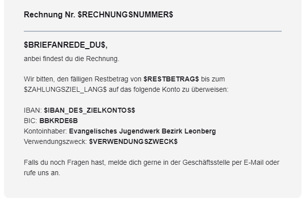
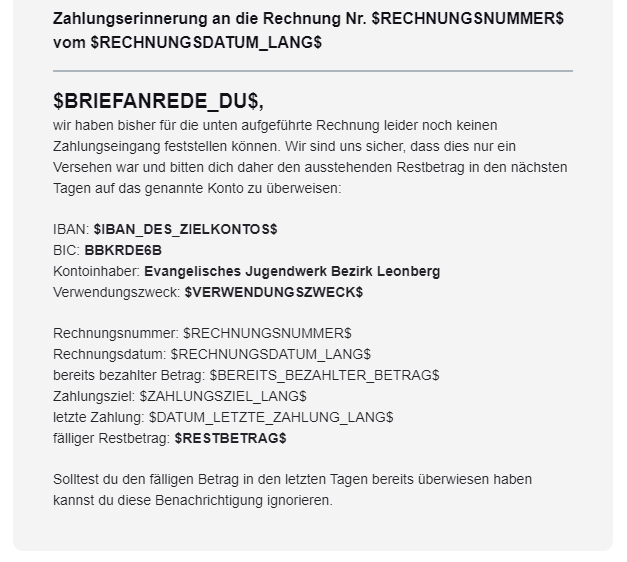

## Rechnungsmails an den Rechnungsempfänger einer Rechnung

_Diese Vorlagen werden für alle Rechnungen verwendet, welche **keine** Verknüpfung zu einer Anmeldung haben._

### Rechnung versenden


  **reguläre Rechnung** (siehe Filter-Einstellungen)


- Filter ⚙: `Ist Stornorechnung` ist `Nein` **UND** `Ist Anzahlung` ist `Nein`
- Anhänge 🔗:  [📄 Rechnung Allgemein](/docs/dokument-vorlagen/#Rechnung-Allgemein)
- Bemerkung 💡: - / -

Betreff:

```
Rechnung $RECHNUNGSNUMMER$ - deine Organisation
```

E-Mail-Vorschautext:

```
$BRIEFANREDE_DU$, anbei findest du die Rechnung (Nr. $RECHNUNGSNUMMER$)
```

E-Mail-Text:

```
Rechnung Nr. $RECHNUNGSNUMMER$
---
$BRIEFANREDE_DU$,
anbei findest du die Rechnung. 

Wir bitten, den fälligen Restbetrag von $RESTBETRAG$ bis zum $ZAHLUNGSZIEL_LANG$ auf das folgende Konto zu überweisen:

IBAN: $IBAN_DES_ZIELKONTOS$
BIC: BIC12346789
Kontoinhaber: Deine Organisation
Verwendungszweck: $VERWENDUNGSZWECK$

Falls du noch Fragen hast, melde dich gerne in der Geschäftsstelle per E-Mail oder rufe uns an.
```

<details>
  <summary>🖥 Vorschau</summary>
  
  

</details>


  **Storno-Rechnung** (siehe Filter-Einstellungen)


- Filter ⚙: `Ist Stornorechnung` ist `Ja` **UND** `Ist Anzahlung` ist `Nein`
- Anhänge 🔗:  [📄 Rechnung Allgemein Storno](/docs/dokument-vorlagen/#Rechnung-Allgemein-Storno)
- Bemerkung 💡: - / -

Betreff:

```
Storno-Rechnung $RECHNUNGSNUMMER$ für $HAUPTRECHNUNGSNUMMER$ - deine Organisation
```

E-Mail-Vorschautext:

```
$BRIEFANREDE_DU$, hiermit stornieren wir die zuvor ausgestellte Rechnung Nr. $HAUPTRECHNUNGSNUMMER$.
```

E-Mail-Text:

```
Storno-Rechnung für die Rechnung Nr. $HAUPTRECHNUNGSNUMMER$
---
$BRIEFANREDE_DU$,
hiermit stornieren wir die zuvor ausgestellte Rechnung Nr. $HAUPTRECHNUNGSNUMMER$.

Falls bereits ein Zahlungseingang erfolgt ist, erstatten wir diesen in den nächsten Tagen.

Für weitere Fragen stehen wir natürlich gerne zur Verfügung.
```

<details>
  <summary>🖥 Vorschau</summary>
  
  

</details>

### Zahlungserinnerung / Mahnung versenden

- Filter ⚙: - / -
- Anhänge 🔗: - / -
- Bemerkung 💡: - / -

Betreff:

```
Zahlungserinnerung - Rechnung $RECHNUNGSNUMMER$ - deine Organisation
```

E-Mail-Vorschautext:

```
Zahlungserinnerung an die Rechnung Nr. $RECHNUNGSNUMMER$ vom $RECHNUNGSDATUM_LANG$
```

E-Mail-Text:

```
Zahlungserinnerung an die Rechnung Nr. $RECHNUNGSNUMMER$ vom $RECHNUNGSDATUM_LANG$
---
$BRIEFANREDE_DU$,
wir haben bisher für die unten aufgeführte Rechnung leider noch keinen Zahlungseingang feststellen können. Wir sind uns sicher, dass dies nur ein Versehen war und bitten dich daher den ausstehenden Restbetrag in den nächsten Tagen auf das genannte Konto zu überweisen:

IBAN: $IBAN_DES_ZIELKONTOS$
BIC: BIC12456
Kontoinhaber: Deine Organisation
Verwendungszweck: $VERWENDUNGSZWECK$

Rechnungsnummer: $RECHNUNGSNUMMER$
Rechnungsdatum: $RECHNUNGSDATUM_LANG$
bereits bezahlter Betrag: $BEREITS_BEZAHLTER_BETRAG$
Zahlungsziel: $ZAHLUNGSZIEL_LANG$
letzte Zahlung: $DATUM_LETZTE_ZAHLUNG_LANG$
fälliger Restbetrag: $RESTBETRAG$

Solltest du den fälligen Betrag in den letzten Tagen bereits überwiesen haben kannst du diese Benachrichtigung ignorieren.
```

<details>
  <summary>🖥 Vorschau</summary>
  
  

</details>