## Mails an die Angemeldeten einer Veranstaltung

### Angemeldete/r bestätigt


  **Teilnehmende** (siehe Filter-Einstellungen)


- Filter ⚙: `Teilnehmerart` ist `Teilnehmer`
- Anhänge 🔗:  [📄 Anmeldebestätigung TN mit Anzahlung](/docs/dokument-vorlagen/#Anmeldebestaetigung-TN-mit-Anzahlung)
- Bemerkung 💡: Wenn eine Veranstaltung keine (!) Anzahlung enthält muss die Vorlage lokal in der Veranstaltung überschrieben werden mit angepasstem Wortlaut.

Betreff:

```
Anmeldebestätigung für $VERANSTALTUNGSNAME$
```

E-Mail-Vorschautext:

```
$BRIEFANREDE_DU$, herzlichen Glückwunsch, du bist dabei!
```

E-Mail-Text:

```
Bestätigung der Anmeldung für $VORNAME$ $NACHNAME$: Angebotsnummer $ANGEBOTSNUMMER$: „$VERANSTALTUNGSNAME$“
---
Wir haben deine Anmeldung zu „$VERANSTALTUNGSNAME$“ in $VERANSTALTUNGSORT$ vom $VERANSTALTUNGSBEGINN_LANG$ bis $VERANSTALTUNGSENDE_LANG$ erhalten und bestätigen hiermit die Teilnahme. Damit ist gemäß unseren Reisebedingungen der Reisevertrag zustande gekommen.

Anbei findest du die ausführliche Anmeldebestätigung sowie weitere, wichtige Hinweise. Bitte lies dir diese aufmerksam durch.

Die beiden Rechnungen für die Freizeit (1x Anzahlung, 1x Restbetrag) versenden wir gesondert von dieser Bestätigung an den angegebenen Rechnungsempfänger.

Spätestens drei Wochen vor Beginn der Freizeit bekommst du einen
ausführlichen Informationsbrief. Für weitere Fragen stehen wir natürlich
gerne zur Verfügung. In $ANZAHL_TAGE_BIS_VERANSTALTUNG$ Tagen geht’s los!

PS: Falls du sowohl Teilnehmende:r als auch Kontaktperson/Rechnungsempfänger:in bist erhältst du ggf. mehrere E-Mails. Das ist beabsichtigt und kein Fehler 👍
```

<details>
  <summary>🖥 Vorschau</summary>
  
  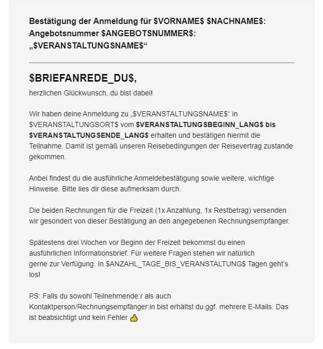

</details>

---


  **Betreuende** (siehe Filter-Einstellungen)


- Filter ⚙: `Teilnehmerart` ist `Betreuer`
- Anhänge 🔗: - / -
- Bemerkung 💡: - / -

Betreff:

```
Anmeldebestätigung für $VERANSTALTUNGSNAME$
```

E-Mail-Vorschautext:

```
$BRIEFANREDE_DU$, herzlichen Glückwunsch, du bist als Mitarbeiter dabei!
```

E-Mail-Text:

```
Bestätigung der Mitarbeiter-Anmeldung für $VORNAME$ $NACHNAME$: Angebotsnummer $ANGEBOTSNUMMER$: „$VERANSTALTUNGSNAME$“
---
$BRIEFANREDE_DU$,
herzlichen Glückwunsch, du bist als Mitarbeiter dabei! Wir sind sehr dankbar, dass du uns unterstützt!

Wir haben deine Anmeldung zu „$VERANSTALTUNGSNAME$“ vom $VERANSTALTUNGSBEGINN_LANG$ bis $VERANSTALTUNGSENDE_LANG$ erhalten und bestätigen hiermit die Teilnahme. Wir haben dich im Team $BETREUERFUNKTION$ zugeordnet.

Weitere Informationen zum Ablauf und der Vorbereitung erhältst du in der Regel direkt von der Freizeitleitung. Für weitere Fragen stehen wir natürlich
gerne zur Verfügung. In $ANZAHL_TAGE_BIS_VERANSTALTUNG$ Tagen geht’s los!

PS: Falls du sowohl Mitarbeitende:r als auch Kontaktperson bist erhältst du ggf. mehrere E-Mails. Das ist beabsichtigt und kein Fehler 👍 
```

<details>
  <summary>🖥 Vorschau</summary>
  
  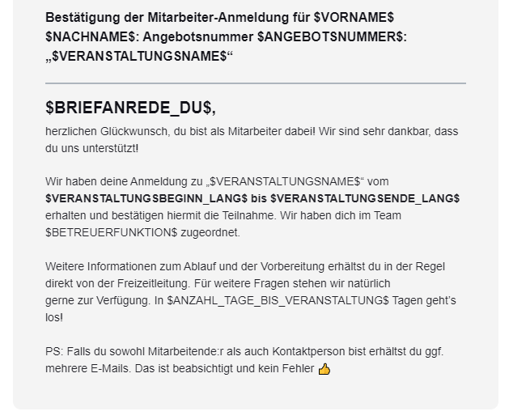

</details>

### Angemeldete/r storniert

- Filter ⚙: - / -
- Anhänge 🔗: - / -
- Bemerkung 💡: Da die Meldung über die Stornierung **nur** an die Teilnehmenden geht setzen wir hier die E-Mail-Adresse der Kontaktperson in CC, damit auch diese (i.d.R. Eltern) informiert werden.
- CC: `$ANMELDUNG_E-MAIL$`

Betreff:

```
Stornierung der Anmeldung für $VERANSTALTUNGSNAME$
```

E-Mail-Vorschautext:

```
$BRIEFANREDE_DU$, wir haben deine Anmeldung zu „$VERANSTALTUNGSNAME$“ in $VERANSTALTUNGSORT$ vom $VERANSTALTUNGSBEGINN_LANG$ bis $VERANSTALTUNGSENDE_LANG$ storniert.
```

E-Mail-Text:

```
Stornierung der Anmeldung für $VORNAME$ $NACHNAME$: Angebotsnummer $ANGEBOTSNUMMER$: „$VERANSTALTUNGSNAME$“ in $VERANSTALTUNGSORT$
---
$BRIEFANREDE_DU$,
wir haben deine Anmeldung zu „$VERANSTALTUNGSNAME$“ in $VERANSTALTUNGSORT$ vom $VERANSTALTUNGSBEGINN_LANG$ bis $VERANSTALTUNGSENDE_LANG$ storniert.

Solltest du noch offene Fragen haben, melde dich gern in der Geschäftsstelle.

PS: Falls du sowohl Teilnehmende:r als auch Kontaktperson/Rechnungsempfänger:in bist erhältst du ggf. mehrere E-Mails. Das ist beabsichtigt und kein Fehler 👍 
```

<details>
  <summary>🖥 Vorschau</summary>
  
  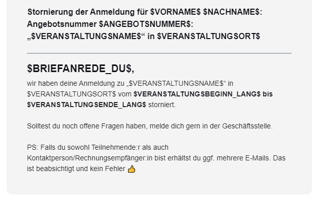

</details>

### Angemeldete/r auf Warteliste gesetzt

- Filter ⚙: - / -
- Anhänge 🔗:  [📄 Information über Warteliste](/docs/dokument-vorlagen/#Anmeldung-TN-Information-Wartenliste)
- Bemerkung 💡: Da die Meldung der Platzierung auf der Warteliste **nur** an die Teilnehmenden geht setzen wri hier die E-Mail-Adresse der Kontaktperson in CC, damit auch diese (i.d.R. Eltern) informiert werden.
- CC: `$ANMELDUNG_E-MAIL$`

Betreff:

```
Wartelistenplatz für $VERANSTALTUNGSNAME$
```

E-Mail-Vorschautext:

```
$BRIEFANREDE_DU$, wir haben deine Anmeldung vom $ANMELDEDATUM_LANG$ zu „$VERANSTALTUNGSNAME$“ vom $VERANSTALTUNGSBEGINN_LANG$ bis $VERANSTALTUNGSENDE_LANG$ erhalten.
```

E-Mail-Text:

```
Information über Wartelisten-Platz für $VORNAME$ $NACHNAME$: Angebotsnummer $ANGEBOTSNUMMER$: „$VERANSTALTUNGSNAME$“ in $VERANSTALTUNGSORT$
---
$BRIEFANREDE_DU$,

wir haben deine Anmeldung zu „$VERANSTALTUNGSNAME$“ in $VERANSTALTUNGSORT$ 
vom $VERANSTALTUNGSBEGINN_LANG$ bis $VERANSTALTUNGSENDE_LANG$ erhalten.

Leider ist die Freizeit bereits voll belegt. Wir können dir deshalb im Moment
keine Zusage geben.

Wir haben deine Anmeldung auf unsere Warteliste gesetzt.
Wenn wir eine Abmeldung von der Freizeit bekommen, rückt deine Anmeldung
automatisch nach. Falls dies der Fall sein sollte, erhältst du von uns sofort Bescheid.

Wenn wir dich von unserer Warteliste streichen sollen, gib uns bitte Bescheid.
Für Rückfragen stehen wir gerne telefonisch oder per E-Mail zu Verfügung

PS: Falls du sowohl Teilnehmende:r als auch Kontaktperson/Rechnungsempfänger:in bist erhältst du ggf. mehrere E-Mails. Das ist beabsichtigt und kein Fehler 👍 
```

<details>
  <summary>🖥 Vorschau</summary>
  
  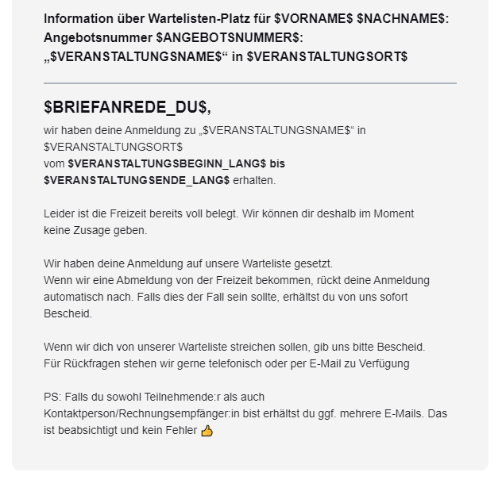

</details>

### Veranstaltungserinnerung versenden

- Filter ⚙: - / -
- Anhänge 🔗: - / -
- Bemerkung 💡: - / -

Betreff:

```
In $ANZAHL_TAGE_BIS_VERANSTALTUNG$ gehts los! $VERANSTALTUNGSNAME$
```

E-Mail-Vorschautext:

```
$BRIEFANREDE_DU$, in $ANZAHL_TAGE_BIS_VERANSTALTUNG$ Tagen geht es endlich los!
```

E-Mail-Text:

```
$BRIEFANREDE_DU$,
in $ANZAHL_TAGE_BIS_VERANSTALTUNG$ Tagen geht es endlich los!

Wir hoffen, die Vorfreude steigt auch auf deiner Seite bereits - das Team im Jugendwerk freut sich bereits auf dich & die gemeinsame Zeit mit dir!

Alle notwendigen Informationen hast du zum jetzigen Zeitpunkt bereits erhalten - sollten bei dir aber noch Fragen offen sein melde dich gern jederzeit bei uns in der Geschäftsstelle. Wir freuen uns auf dich!

PS: Falls du sowohl Teilnehmende:r als auch Kontaktperson/Rechnungsempfänger:in bist erhältst du ggf. mehrere E-Mails. Das ist beabsichtigt und kein Fehler 👍 
```

<details>
  <summary>🖥 Vorschau</summary>
  
  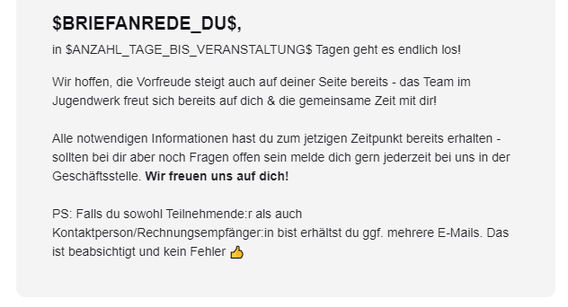

</details>

### Neue Anmeldung


  An diese Mail wird automatisch eine PDF-Datei angehängt, welche alle Eingabedaten aller Teilnehmenden enthält. Diese Vorlage sollte daher möglichst **nicht** in Verbindung mit Gruppenanmeldungen verwendet werden!



  **Teilnehmende** (siehe Filter-Einstellungen)


- Filter ⚙: `Teilnehmerart` ist `Teilnehmer`
- Anhänge 🔗:  [📄 Eingangsbestätigung Teilnehmende](/docs/dokument-vorlagen/#Anmeldung-TN-Eingangsbestaetigung)
- Bemerkung 💡: - / -

Betreff:

```
Eingangsbestätigung der Anmeldung für $VERANSTALTUNGSNAME$
```

E-Mail-Vorschautext:

```
$BRIEFANREDE_DU$, wir haben deine Anmeldung vom $ANMELDEDATUM_LANG$ zu „$VERANSTALTUNGSNAME$“ vom $VERANSTALTUNGSBEGINN_LANG$ bis $VERANSTALTUNGSENDE_LANG$ erhalten.
```

E-Mail-Text:

```
Eingangsbestätigung der Anmeldung für Angebotsnummer $ANGEBOTSNUMMER$: „$VERANSTALTUNGSNAME$“ in $VERANSTALTUNGSORT$
---
$BRIEFANREDE_DU$,
wir haben deine Anmeldung vom $ANMELDEDATUM_LANG$ zu „$VERANSTALTUNGSNAME$“ vom $VERANSTALTUNGSBEGINN_LANG$ bis $VERANSTALTUNGSENDE_LANG$ erhalten.

Anmeldungsnummer: $ANMELDUNGSNUMMER$

Dies ist eine Bestätigung über den Eingang der Anmeldung, keine verbindliche Anmeldebestätigung. Wir prüfen nun deine Anmeldung und melden uns so bald wie möglich bei dir. Eine Anmeldebestätigung folgt, sobald unsere Mitarbeitenden diese bearbeitet haben. Aufgrund hohen Anmeldeaufkommens kann das einige Tage in Anspruch nehmen. Wir bitten von telefonischen Anfragen des Anmeldestatus abzusehen, da dies unsere Bearbeitungszeit verlängert.

Falls du noch Fragen hast, melde dich gerne einfach per E-Mail oder rufe kurz bei uns an. Wir freuen uns auf eine tolle Zeit mit dir!

PS: Falls du sowohl Teilnehmende:r als auch Kontaktperson/Rechnungsempfänger:in bist erhältst du ggf. mehrere E-Mails. Das ist beabsichtigt und kein Fehler 👍 
```

<details>
  <summary>🖥 Vorschau</summary>
  
  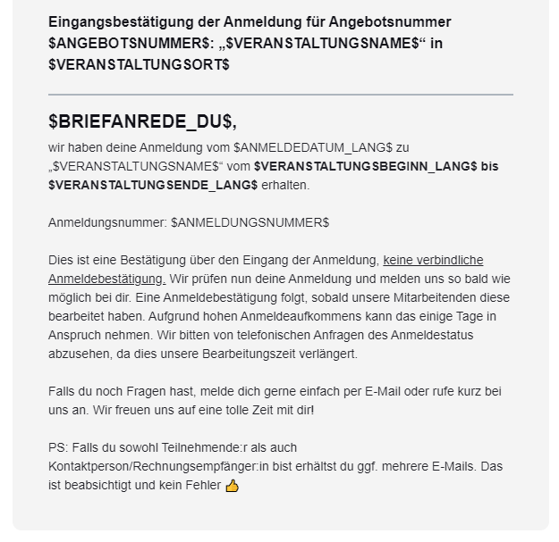

</details>

---


  **Betreuende** (siehe Filter-Einstellungen)


- Filter ⚙: `Teilnehmerart` ist `Betreuer`
- Anhänge 🔗: - / -
- Bemerkung 💡: - / -

Betreff:

```
Eingangsbestätigung der Mitarbeiter-Anmeldung für $VERANSTALTUNGSNAME$
```

E-Mail-Vorschautext:

```
$BRIEFANREDE_DU$, wir haben deine Mitarbeiter-Anmeldung vom $ANMELDEDATUM_LANG$ zu „$VERANSTALTUNGSNAME$“ vom $VERANSTALTUNGSBEGINN_LANG$ bis $VERANSTALTUNGSENDE_LANG$ erhalten.
```

E-Mail-Text:

```
Eingangsbestätigung der Mitarbeiter-Anmeldung für Angebotsnummer $ANGEBOTSNUMMER$: „$VERANSTALTUNGSNAME$“
---
$BRIEFANREDE_DU$,
wir haben deine Mitarbeiter-Anmeldung vom $ANMELDEDATUM_LANG$ Uhr zu „$VERANSTALTUNGSNAME$“ vom $VERANSTALTUNGSBEGINN_LANG$ bis $VERANSTALTUNGSENDE_LANG$ erhalten.

Anmeldungsnummer: $ANMELDUNGSNUMMER$
Betreuerfunktion/Team: $BETREUERFUNKTION$

Dies ist eine Bestätigung über den Eingang der Anmeldung, keine verbindliche Anmeldebestätigung. Wir prüfen nun deine Anmeldung und melden uns so bald wie möglich bei dir.

Falls du noch Fragen hast, melde dich gerne einfach per E-Mail oder rufe kurz bei uns an. Wir freuen uns auf eine tolle Zeit mit dir!

PS: Falls du sowohl Mitarbeitende:r als auch Kontaktperson bist erhältst du ggf. mehrere E-Mails. Das ist beabsichtigt und kein Fehler 👍 
```

<details>
  <summary>🖥 Vorschau</summary>
  
  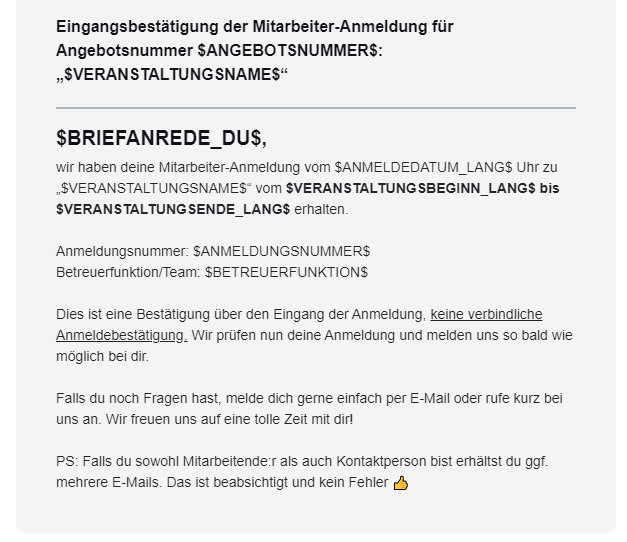

</details>

### Ticketmail

- Bemerkung 💡: dafür haben wir aktuell noch keine Vorlage, da wir das Ticket-Feature bisher nicht genutzt haben!

## Mails an Rechnungsempfänger / Kontaktperson einer Anmeldung

### Neue Anmeldung


  **Teilnehmende** (siehe Filter-Einstellungen)


- Filter ⚙: `Anmeldungsart` ist `Anmeldung für Teilnehmende`
- Anhänge 🔗:  [📄 Eingangsbestätigung Rechnungsempfänger](/docs/dokument-vorlagen/#Anmeldung-RE-Eingangsbestaetigung)
- Bemerkung 💡: - / -

Betreff:

```
Eingangsbestätigung der Anmeldung für $VERANSTALTUNGSNAME$
```

E-Mail-Vorschautext:

```
$BRIEFANREDE_DU$, wir haben deine Anmeldung vom $ANMELDEDATUM_LANG$ zu „$VERANSTALTUNGSNAME$“ vom $VERANSTALTUNGSBEGINN_LANG$ bis $VERANSTALTUNGSENDE_LANG$ erhalten.
```

E-Mail-Text:

```
Eingangsbestätigung der Anmeldung für Angebotsnummer $ANGEBOTSNUMMER$: „$VERANSTALTUNGSNAME$“
---
$BRIEFANREDE_DU$,
wir haben (d)eine Anmeldung vom $ANMELDEDATUM_LANG$ $ANMELDEDATUM_UHRZEIT$ Uhr zu „$VERANSTALTUNGSNAME$“ in $VERANSTALTUNGSORT$ vom $VERANSTALTUNGSBEGINN_LANG$ bis $VERANSTALTUNGSENDE_LANG$ erhalten.

Anmeldungsnummer: $ANMELDUNGSNUMMER$
Angemeldete Teilnehmende: $NAMEN_DER_TEILNEHMENDEN$ ( Σ $ANZAHL_AN_TEILNEHMENDEN$ Teilnehmende)
Bemerkungen: $BEMERKUNGEN_DES_ANMELDENDEN$

Dies ist eine Bestätigung über den Eingang der Anmeldung, keine verbindliche Anmeldebestätigung. Wir prüfen nun deine Anmeldung und melden uns so bald wie möglich bei dir. Eine Anmeldebestätigung folgt, sobald unsere Mitarbeitenden diese bearbeitet haben. Aufgrund hohen Anmeldeaufkommens kann das einige Tage in Anspruch nehmen. Wir bitten von telefonischen Anfragen des Anmeldestatus abzusehen, da dies unsere Bearbeitungszeit verlängert.

Falls du noch Fragen hast, melde dich gerne einfach per E-Mail oder rufe kurz bei uns an. Wir freuen uns auf eine tolle Zeit mit dir!

PS: Falls du sowohl Teilnehmende:r als auch Kontaktperson/Rechnungsempfänger:in bist erhältst du ggf. mehrere E-Mails. Das ist beabsichtigt und kein Fehler 👍 
```

<details>
  <summary>🖥 Vorschau</summary>
  
  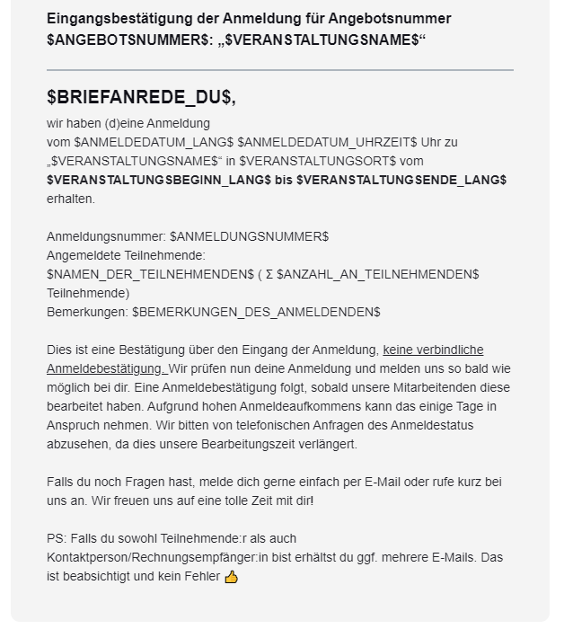

</details>

---


  **Betreuende** (siehe Filter-Einstellungen)

- Filter ⚙: `Anmeldungsart` ist `Anmeldung für Betreuende`
- Anhänge 🔗: - / -
- Bemerkung 💡: - / -

Betreff:

```
Eingangsbestätigung der Mitarbeiter-Anmeldung für $VERANSTALTUNGSNAME$
```

E-Mail-Vorschautext:

```
$BRIEFANREDE_DU$, wir haben deine Mitarbeiter-Anmeldung vom $ANMELDEDATUM_LANG$ zu „$VERANSTALTUNGSNAME$“ vom $VERANSTALTUNGSBEGINN_LANG$ bis $VERANSTALTUNGSENDE_LANG$ erhalten.
```

E-Mail-Text:

```
Eingangsbestätigung der Mitarbeiter-Anmeldung für Angebotsnummer $ANGEBOTSNUMMER$: „$VERANSTALTUNGSNAME$“
---
$BRIEFANREDE_DU$,
wir haben deine Mitarbeiter-Anmeldung vom $ANMELDEDATUM_LANG$ zu „$VERANSTALTUNGSNAME$“ in $VERANSTALTUNGSORT$ vom $VERANSTALTUNGSBEGINN_LANG$ bis $VERANSTALTUNGSENDE_LANG$ erhalten.

Anmeldungsnummer: $ANMELDUNGSNUMMER$
Angemeldete Mitarbeitende: $NAMEN_DER_TEILNEHMENDEN$ ( Σ $ANZAHL_AN_TEILNEHMENDEN$ Mitarbeitende)

Dies ist eine Bestätigung über den Eingang der Anmeldung, keine verbindliche Anmeldebestätigung. Wir prüfen nun deine Anmeldung und melden uns so bald wie möglich bei dir.

Falls du noch Fragen hast, melde dich gerne einfach per E-Mail oder rufe kurz bei uns an. Wir freuen uns auf eine tolle Zeit mit dir!

PS: Falls du sowohl Mitarbeitende:r als auch Kontaktperson bist erhältst du ggf. mehrere E-Mails. Das ist beabsichtigt und kein Fehler 👍 
```

<details>
  <summary>🖥 Vorschau</summary>
  
  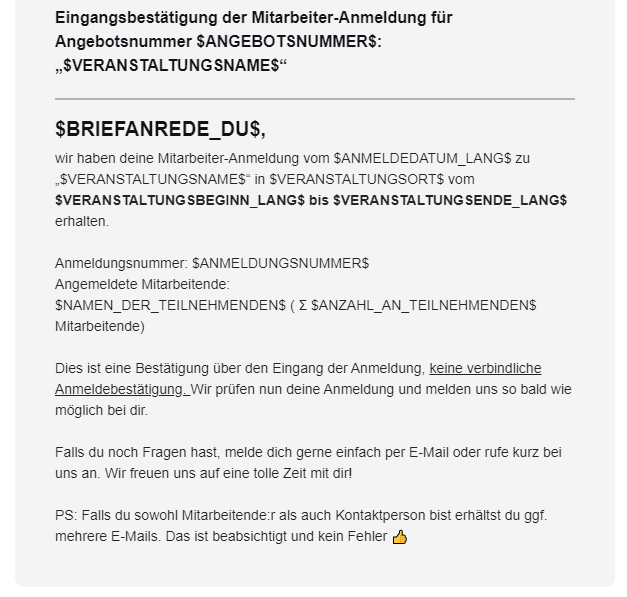

</details>

### Anmeldung bestätigt


  **Teilnehmende** (siehe Filter-Einstellungen)


- Filter ⚙: `Anmeldungsart` ist `Anmeldung für Teilnehmende`
- Anhänge 🔗:  [📄 Anmeldebestätigung Rechnungsempfänger (mit Anzahlung)](/docs/dokument-vorlagen/#Anmeldebestaetigung-RE-mit-Anzahlung)
- Bemerkung 💡: - / -

Betreff:

```
Anmeldebestätigung für $VERANSTALTUNGSNAME$
```

E-Mail-Vorschautext:

```
$BRIEFANREDE_DU$, herzlichen Glückwunsch, du bist dabei!
```

E-Mail-Text:

```
Bestätigung der Anmeldung für $NAMEN_DER_TEILNEHMENDEN$: Angebotsnummer $ANGEBOTSNUMMER$: „$VERANSTALTUNGSNAME$“ in $VERANSTALTUNGSORT$
---
$BRIEFANREDE_DU$,
wir haben (d)eine Anmeldung zu „$VERANSTALTUNGSNAME$“ in $VERANSTALTUNGSORT$ vom $VERANSTALTUNGSBEGINN_LANG$ bis $VERANSTALTUNGSENDE_LANG$ erhalten und bestätigen hiermit die Teilnahme von $NAMEN_DER_TEILNEHMENDEN$. Herzlichen Glückwunsch! 

Damit ist gemäß unseren Reisebedingungen der Reisevertrag zustande gekommen. Anbei findest du die ausführliche Anmeldebestätigung sowie weitere, wichtige Hinweise. Bitte lies dir diese aufmerksam durch.

Die beiden Rechnungen für die Freizeit (1x Anzahlung, 1x Restbetrag) erhältst du gesondert von dieser Bestätigung. Bitte beachte hierbei das Zahlungsziel der Anzahlung.

Spätestens drei Wochen vor Beginn der Freizeit bekommst du einen
ausführlichen Informationsbrief. Für weitere Fragen stehen wir natürlich
gerne zur Verfügung. In $ANZAHL_TAGE_BIS_VERANSTALTUNG$ Tagen geht’s los!

PS: Falls du sowohl Teilnehmende:r als auch Kontaktperson/Rechnungsempfänger:in bist erhältst du ggf. mehrere E-Mails. Das ist beabsichtigt und kein Fehler 👍 
```

<details>
  <summary>🖥 Vorschau</summary>
  
  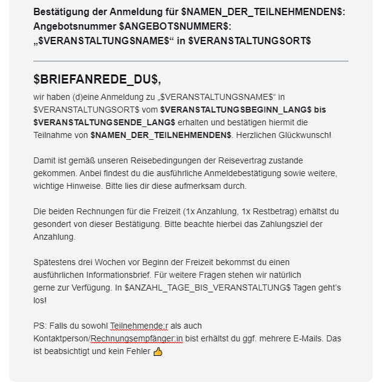

</details>

---


  **Betreuende** (siehe Filter-Einstellungen)


- Filter ⚙: `Anmeldungsart` ist `Anmeldung für Betreuende`
- Anhänge 🔗:  - / -
- Bemerkung 💡: - / -

Betreff:

```
Anmeldebestätigung für $VERANSTALTUNGSNAME$
```

E-Mail-Vorschautext:

```
$BRIEFANREDE_DU$, herzlichen Glückwunsch, du bist dabei!
```

E-Mail-Text:

```
Bestätigung der Mitarbeiter-Anmeldung von $NAMEN_DER_TEILNEHMENDEN$: Angebotsnummer $ANGEBOTSNUMMER$: „$VERANSTALTUNGSNAME$“
---
$BRIEFANREDE_DU$,
herzlichen Glückwunsch, du bist als Mitarbeiter dabei! Wir sind sehr dankbar, dass du uns unterstützt!

Wir haben deine Anmeldung zu „$VERANSTALTUNGSNAME$“ vom $VERANSTALTUNGSBEGINN_LANG$ bis $VERANSTALTUNGSENDE_LANG$ erhalten und bestätigen hiermit die Teilnahme.

Weitere Informationen zum Ablauf und der Vorbereitung erhältst du in der Regel direkt von der Freizeitleitung. Für weitere Fragen stehen wir natürlich
gerne zur Verfügung. In $ANZAHL_TAGE_BIS_VERANSTALTUNG$ Tagen geht’s los!

PS: Falls du sowohl Mitarbeitende:r als auch Kontaktperson bist erhältst du ggf. mehrere E-Mails. Das ist beabsichtigt und kein Fehler 👍 

```

<details>
  <summary>🖥 Vorschau</summary>
  
  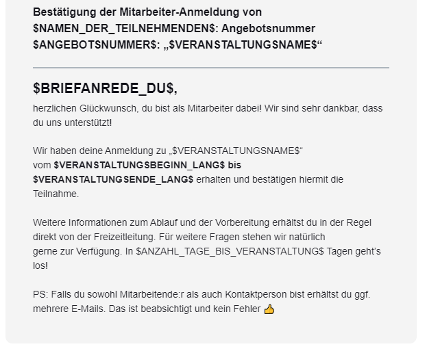

</details>

### Neue Gruppenanmeldung erstellt

- Filter ⚙: - / -
- Anhänge 🔗:  [📄 Anmeldebestätigung TN mit Anzahlung](/docs/dokument-vorlagen/#Anmeldebestaetigung-TN-mit-Anzahlung)
- Bemerkung 💡: Hier kann keine persönliche Anrede verwendet werden, da der Platzhalter hier nicht verfügbar ist.

Betreff:

```
Neue Gruppenanmeldung für $VERANSTALTUNGSNAME$ erstellt
```

E-Mail-Vorschautext:

```
Hey, wir haben die Gruppenanmeldung zu „$VERANSTALTUNGSNAME$“ vom $VERANSTALTUNGSBEGINN_LANG$ bis $VERANSTALTUNGSENDE_LANG$ erhalten.
```

E-Mail-Text:

```
Neue Gruppenanmeldung für $ANGEBOTSNUMMER$: „$VERANSTALTUNGSNAME$“ in $VERANSTALTUNGSORT$ erstellt
---
Hey,
wir haben die Gruppenanmeldung zu „$VERANSTALTUNGSNAME$“ in $VERANSTALTUNGSORT$
vom $VERANSTALTUNGSBEGINN_LANG$ bis $VERANSTALTUNGSENDE_LANG$ erhalten.

Anmeldungsnummer: $ANMELDUNGSNUMMER$

Diesen Link bitte nicht an deine Gruppenteilnehmenden weitergeben. Über diesen Link kannst du die Anmeldungen deiner Gruppenteilnehmenden überprüfen und bestätigen. Wenn alle Anmeldungen eingegangen sind kannst du darüber die Anmeldung schließen und abschicken.

Diesen Link kannst du an deine Gruppenteilnehmenden weiterleiten. Diese können sich dann zu Deiner Gruppe anmelden.

Wir prüfen die angemeldeten Teilnehmer deiner Gruppenanmeldung erst, nachdem du diese abgeschlossen und abgeschickt hast und melden uns so bald wie möglich bei dir.

Falls du noch Fragen hast, melde dich gerne einfach per E-Mail oder rufe kurz bei uns an. Wir freuen uns auf eine tolle Zeit mit dir!
```

💡 Code-Block Buttons inkl. Text (2-spaltiger Absatz)

``` html
<re-grid>
    <re-column padding="0 0 20px 0" width="50%" valign="top">
        <re-button background-color="#123a5e" font-size="16px" href="$GRUPPENLINK_VERANTWORTLICHE_PERSON$">
            Verwaltung der&nbsp; Anmeldungen
        </re-button>
        <re-spacer></re-spacer>
        <re-text>
            Diesen Link bitte&nbsp;<u>nicht</u>&nbsp;an deine Gruppenteilnehmenden weitergeben. Über diesen Link kannst du die Anmeldungen deiner Gruppenteilnehmenden überprüfen und bestätigen. Wenn alle Anmeldungen eingegangen sind kannst du darüber die Anmeldung schließen und abschicken.
        </re-text>
    </re-column>
    <re-column-spacer></re-column-spacer>
    <re-column padding="0 0 20px 0" width="50%" valign="top">
        <re-button color="#ffffff" background-color="#f29400" font-size="16px" href="$GRUPPENLINK_TEILNEHMENDE$">
            Anmeldelink für Teilnehmende
        </re-button>
        <re-spacer></re-spacer>
        <re-text>
            Diesen Link kannst du an deine Gruppenteilnehmenden weiterleiten. Diese können sich dann zu Deiner Gruppe anmelden.
        </re-text>
    </re-column>
</re-grid>
```

<details>
  <summary>🖥 Vorschau</summary>
  
  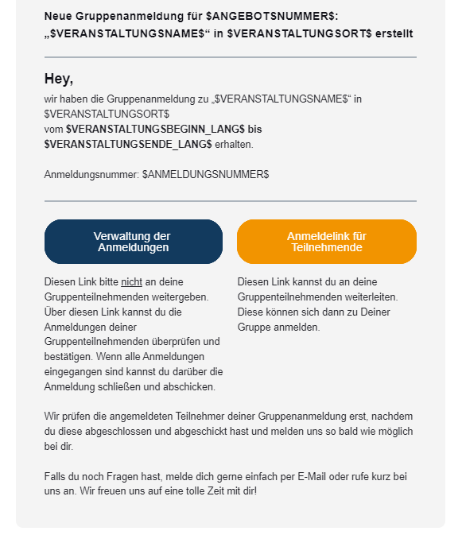

</details>

## Rechnungsmails an den Rechnungsempfänger einer Anmeldung

_Diese Vorlagen werden für alle Rechnungen verwendet, welche aus einer Anmeldung erzeugt wurden, oder für Rechnungen bei denen eine Anmeldung händisch hinterlegt wurde._

### Rechnung versenden


  **Haupt-Rechnung** (siehe Filter-Einstellungen)


- Filter ⚙: `ist Stornorechnung` ist `Nein` **UND** `ist Anzahlung` ist `Nein` 
- Anhänge 🔗:  [📄 Rechnung für Angebot (ohne Anzahlung)](/docs/dokument-vorlagen/#Rechnung-Angebot-ohne-Anzahlung)
- Bemerkung 💡: - / -

Betreff:

```
Rechnung für die Teilnahme an $VERANSTALTUNGSNAME$ ($ANGEBOTSNUMMER$ - $RECHNUNGSNUMMER$)
```

E-Mail-Vorschautext:

```
$BRIEFANREDE_DU$, anbei findest du die Rechnung für die Teilnahme an „$VERANSTALTUNGSNAME$“ vom $VERANSTALTUNGSBEGINN_LANG$ bis $VERANSTALTUNGSENDE_LANG$.
```

E-Mail-Text:

```
Rechnung für die Teilnahme am Angebot $ANGEBOTSNUMMER$: „$VERANSTALTUNGSNAME$“ in $VERANSTALTUNGSORT$
---
$BRIEFANREDE_DU$,
anbei findest du die Rechnung für die Teilnahme an „$VERANSTALTUNGSNAME$“ vom $VERANSTALTUNGSBEGINN_LANG$ bis $VERANSTALTUNGSENDE_LANG$ .

Wir bitten, den fälligen Restbetrag von $RESTBETRAG$ bis zum $FORMATIERTES_ZAHLUNGSZIEL$ auf das folgende Konto zu überweisen:

IBAN: $IBAN_DES_ZIELKONTOS$
BIC: BIC12456
Kontoinhaber: Deine Organisation
Verwendungszweck: $VERWENDUNGSZWECK$

Spätestens drei Wochen vor Beginn der Freizeit bekommst du einen ausführlichen Informationsbrief. Für weitere Fragen stehen wir natürlich gerne zur Verfügung.
```

<details>
  <summary>🖥 Vorschau</summary>
  
  

</details>


  **Anzahlungsrechnung** (siehe Filter-Einstellungen)


- Filter ⚙: `ist Anzahlung` ist `Ja`
- Anhänge 🔗:  [📄 Rechnung für Angebot (mit Anzahlung)](/docs/dokument-vorlagen/#Rechnung-Angebot-mit-Anzahlung)
- Bemerkung 💡: - / -

Betreff:

```
Anzahlungsrechnung für die Teilnahme an $VERANSTALTUNGSNAME$ ($ANGEBOTSNUMMER$ - $RECHNUNGSNUMMER$)
```

E-Mail-Vorschautext:

```
$BRIEFANREDE_DU$, anbei findest du die Anzahlungsrechnung für die Teilnahme an „$VERANSTALTUNGSNAME$“ vom $FORMATIERTER_VERANSTALTUNGSBEGINN$ bis $FORMATIERTES_VERANSTALTUNGSENDE$.
```

E-Mail-Text:

```
Rechnung für die Teilnahme am Angebot $ANGEBOTSNUMMER$: „$VERANSTALTUNGSNAME$“ in $VERANSTALTUNGSORT$
---
$BRIEFANREDE_DU$,
anbei findest du die Rechnung für die Teilnahme an „$VERANSTALTUNGSNAME$“ vom $FORMATIERTER_VERANSTALTUNGSBEGINN$ bis $FORMATIERTES_VERANSTALTUNGSENDE$.

Wir bitten, die Anzahlung von $RESTBETRAG$ bis zum $ZAHLUNGSZIEL$ auf das folgende Konto zu überweisen:

IBAN: $IBAN_DES_ZIELKONTOS$
BIC: BIC12456
Kontoinhaber: Deine Organisation
Verwendungszweck: $VERWENDUNGSZWECK$

Der Restbetrag ist bis spätestens zwei Wochen vor Beginn der Freizeit am $VERANSTALTUNGSBEGINN$ fällig, hierfür erhältst du eine separate Rechnung.

Spätestens drei Wochen vor Beginn der Freizeit bekommst du einen ausführlichen Informationsbrief. Für weitere Fragen stehen wir natürlich gerne zur Verfügung.
```

<details>
  <summary>🖥 Vorschau</summary>
  
  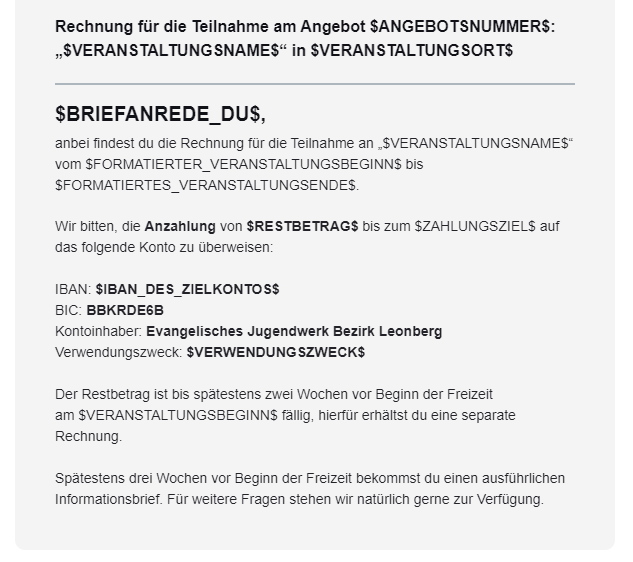

</details>


  **Storno-Rechnung** (siehe Filter-Einstellungen)


- Filter ⚙: `ist Stornorechnung` ist `Ja` **UND** `ist Anzahlung` ist `Ja`
- Anhänge 🔗:  [📄 Storno-Rechnung für Angebot](/docs/dokument-vorlagen/#Rechnung-Angebot-Storno)
- Bemerkung 💡: - / -

Betreff:

```
Storno-Rechnung für die Teilnahme an $VERANSTALTUNGSNAME$ ($ANGEBOTSNUMMER$ - $RECHNUNGSNUMMER$)
```

E-Mail-Vorschautext:

```
$BRIEFANREDE_DU$, für die Teilnahme an „$VERANSTALTUNGSNAME$“ vom $VERANSTALTUNGSBEGINN_LANG$ bis $VERANSTALTUNGSENDE_LANG$ stornieren wir die zuvor ausgestellte Rechnung Nr. $HAUPTRECHNUNGSNUMMER$.
```

E-Mail-Text:

```
Storno-Rechnung für die Teilnahme am Angebot $ANGEBOTSNUMMER$: „$VERANSTALTUNGSNAME$“ in $VERANSTALTUNGSORT$
---
$BRIEFANREDE_DU$,
für die Teilnahme an „$VERANSTALTUNGSNAME$“ vom $VERANSTALTUNGSBEGINN_LANG$ bis $VERANSTALTUNGSENDE_LANG$ stornieren wir die zuvor ausgestellte Rechnung Nr. $HAUPTRECHNUNGSNUMMER$.

Falls bereits ein Zahlungseingang erfolgt ist, erstatten wir diesen in den nächsten Tagen.

Für weitere Fragen stehen wir natürlich gerne zur Verfügung.
```

<details>
  <summary>🖥 Vorschau</summary>
  
  

</details>

### Zahlungserinnerung / Mahnung versenden

- Filter ⚙: - / -
- Anhänge 🔗:  - / -
- Bemerkung 💡: - / -

Betreff:

```
Zahlungserinnerung - Rechnung für die Teilnahme an $VERANSTALTUNGSNAME$ ($ANGEBOTSNUMMER$ - $RECHNUNGSNUMMER$)
```

E-Mail-Vorschautext:

```
$BRIEFANREDE_DU$, wir haben bisher leider noch keinen Zahlungseingang feststellen können. Wir sind uns sicher, dass dies nur ein Versehen war und bitten dich daher den ausstehenden Restbetrag in den nächsten Tagen zu überweisen.
```

E-Mail-Text:

```
Zahlungserinnerung an die Rechnung für die Teilnahme am Angebot $ANGEBOTSNUMMER$: „$VERANSTALTUNGSNAME$“ in $VERANSTALTUNGSORT$
---
$BRIEFANREDE_DU$,
wir haben bisher für die unten aufgeführte Rechnung leider noch keinen Zahlungseingang feststellen können. Wir sind uns sicher, dass dies nur ein Versehen war und bitten dich daher den ausstehenden Restbetrag in den nächsten Tagen auf das genannte Konto zu überweisen:

IBAN: $IBAN_DES_ZIELKONTOS$
BIC: BIC12456
Kontoinhaber: Deine Organisation
Verwendungszweck: $VERWENDUNGSZWECK$

Rechnungsnummer: $RECHNUNGSNUMMER$
Rechnungsdatum: $RECHNUNGSDATUM_LANG$
bereits bezahlter Betrag: $BEREITS_BEZAHLTER_BETRAG$
Zahlungsziel: $ZAHLUNGSZIEL_LANG$
letzte Zahlung: $DATUM_LETZTE_ZAHLUNG_LANG$
fälliger Restbetrag: $RESTBETRAG$

Solltest du den fälligen Betrag in den letzten Tagen bereits überwiesen haben kannst du diese Benachrichtigung ignorieren.
```

<details>
  <summary>🖥 Vorschau</summary>
  
  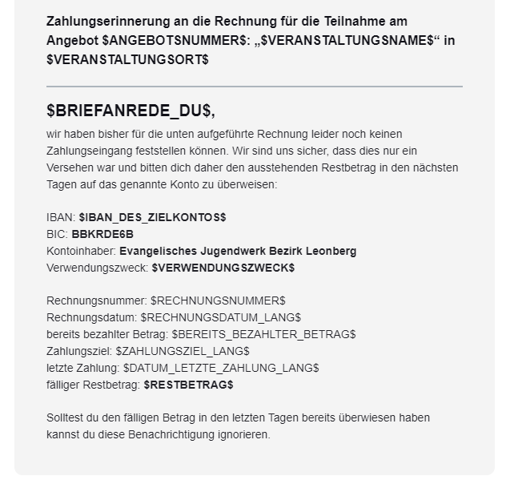

</details>

## Mails an die Sachbearbeitung einer Veranstaltung

### Neue Anmeldung


  **Teilnehmende** (siehe Filter-Einstellungen)


- Filter ⚙: `Anmeldungsart` ist `Anmeldung für Teilnehmende`
- Anhänge 🔗:  - / -
- Bemerkung 💡: Im Button wird automatisch via Platzhalter ein Link erzeugt, der zur jeweiligen Seite führt 🎉

Betreff:

``` text
Neue Anmeldung für $ANGEBOTSNUMMER$: "$VERANSTALTUNGSNAME$" (A-$ANMELDUNGSNUMMER$, $ANZAHL_AN_TEILNEHMENDEN$ TN)
```

E-Mail-Vorschautext:

``` text
Hallo $SACHBEARBEITUNG_VORNAME$, am $ANMELDEDATUM_LANG$ ging eine neue Anmeldung für $ANGEBOTSNUMMER$: „$VERANSTALTUNGSNAME$“ ein: $NAMEN_DER_TEILNEHMENDEN$ ( Σ $ANZAHL_AN_TEILNEHMENDEN$ Teilnehmende)
```

E-Mail-Text:

``` text
Benachrichtigung über den Eingang einer Anmeldung für $ANGEBOTSNUMMER$: „$VERANSTALTUNGSNAME$“
---
Hallo $SACHBEARBEITUNG_VORNAME$,

am $ANMELDEDATUM_UHRZEIT$ ging eine neue Anmeldung für $ANGEBOTSNUMMER$: „$VERANSTALTUNGSNAME$“ ein:

Anmeldungsnummer: $ANMELDUNGSNUMMER$
Angemeldete Teilnehmende: $NAMEN_DER_TEILNEHMENDEN$ ( Σ $ANZAHL_AN_TEILNEHMENDEN$ Teilnehmende)
Bemerkungen: $BEMERKUNGEN_DES_ANMELDENDEN$
```

💡 Der Button-Abschnitt hat folgenden Code:

``` html
<re-grid>
    <re-column padding="0 0 20px 0" width="50%">
        <re-button font-size="16px" background-color="#068b65" href="https://ejwleo.amosweb.de/app/events/registration/$ANMELDUNGSNUMMER$/registrationOverview">
            <b>zur Anmeldung</b> 📧
        </re-button>
    </re-column>
    <re-column-spacer></re-column-spacer>
    <re-column padding="0 0 20px 0" width="50%">
        <re-button font-size="16px" background-color="#09be8b" href="https://ejwleo.amosweb.de/app/events/$VERANSTALTUNGS_ID$/eventOverview">
            <b>zur Veranstaltung 🔗</b>
        </re-button>
    </re-column>
</re-grid>
```

<details>
  <summary>🖥 Vorschau</summary>
  
  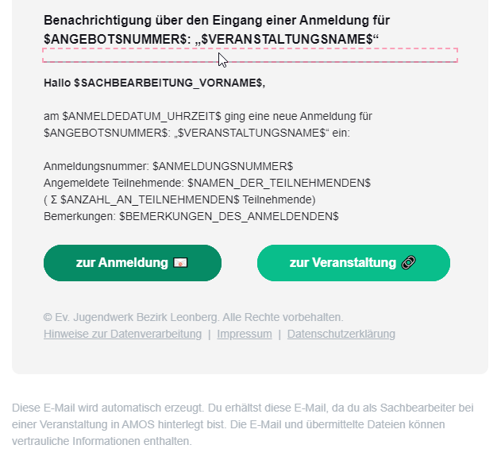

</details>


  **Betreuende** (siehe Filter-Einstellungen)


- Filter ⚙: `Anmeldungsart` ist `Anmeldung für Betreuende`
- Anhänge 🔗: - / -
- Bemerkung 💡: Im Button wird automatisch via Platzhalter ein Link erzeugt, der zur jeweiligen Seite führt 🎉

Betreff:

```
Neue Mitarbeiter-Anmeldung für $ANGEBOTSNUMMER$: "$VERANSTALTUNGSNAME$" (A-$ANMELDUNGSNUMMER$, $ANZAHL_AN_TEILNEHMENDEN$ MA)
```

E-Mail-Vorschautext:

```
Hallo $SACHBEARBEITUNG_VORNAME$, am $ANMELDEDATUM_UHRZEIT$ Uhr ging eine neue Mitarbeiter-Anmeldung für $ANGEBOTSNUMMER$: „$VERANSTALTUNGSNAME$“ ein: $NAMEN_DER_TEILNEHMENDEN$ ( Σ $ANZAHL_AN_TEILNEHMENDEN$ Mitarbeitende)
```

E-Mail-Text:

```
Benachrichtigung über den Eingang einer Mitarbeiter-Anmeldung für $ANGEBOTSNUMMER$: „$VERANSTALTUNGSNAME$“
---
Hallo $SACHBEARBEITUNG_VORNAME$,

am $ANMELDEDATUM$ ging eine neue Mitarbeiter-Anmeldung für $ANGEBOTSNUMMER$: „$VERANSTALTUNGSNAME$“ ein:

Anmeldungsnummer: $ANMELDUNGSNUMMER$
Angemeldete Mitarbeitende: $NAMEN_DER_TEILNEHMENDEN$ ( Σ $ANZAHL_AN_TEILNEHMENDEN$ Mitarbeitende)
Bemerkungen: $BEMERKUNGEN_DES_ANMELDENDEN$
```

<details>
  <summary>🖥 Vorschau</summary>
  
  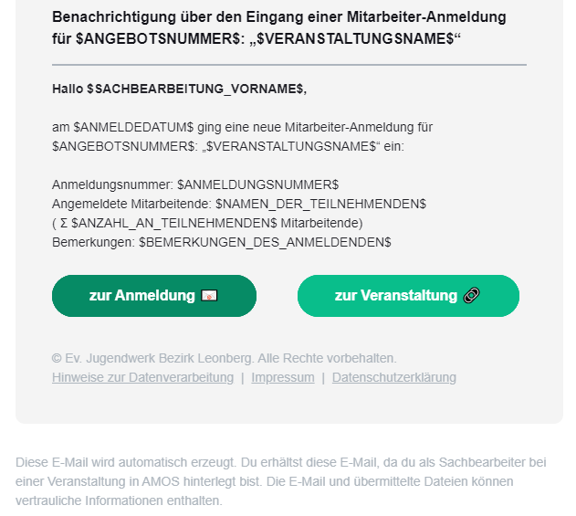

</details>

## Mails an die Veranstaltungsleitungen

_Veranstaltungsleitungen können über einen Freigabelink Zugriff auf Teilnehmerlisten bekommen._

### Freigabelink senden

- Filter ⚙: - / -
- Anhänge 🔗:  - / -
- Bemerkung 💡: - / -

Betreff:

```
Neue Leitungsfreigabe für $ANGEBOTSNUMMER$: "$VERANSTALTUNGSNAME$" (vertraulich)
```

E-Mail-Vorschautext:

```
Neue Freigabe für externe Veranstaltungsleitung für  $ANGEBOTSNUMMER$: „$VERANSTALTUNGSNAME$“ verfügbar
```

E-Mail-Text:

```
Neue Freigabe für externe Veranstaltungsleitung für  $ANGEBOTSNUMMER$: „$VERANSTALTUNGSNAME$“ verfügbar
---
Hallo $BRIEFANREDE_DU$,

in deiner Rolle als externe Veranstaltungsleitung für $VERANSTALTUNGSNAME$ ($ANGEBOTSNUMMER$) erhältst du über diese Freigabe den Zugang zu den veranstaltungsbezogenen AMOS-Daten im DEINE ORGANISATION.

Die Freigabe wurde für dich mit folgenden Daten hinterlegt:
E-Mail-Adresse: $E-MAIL$
Telefonnummer: $MOBIL$

Über den Button unten kommst du zur Web-Ansicht. Dort kannst du einen Zugangscode per SMS an deine Telefonnummer anfordern. Nach dessen Eingabe kannst du die Anmeldungen - und Teilnahme der Veranstaltung einsehen und Exporte (bspw. Teilnehmerlisten etc) generieren.

⚠ Die dort verfügbaren Daten sind vertraulich und dürfen in keinem Fall an externe weitergegeben oder diesen zugänglich gemacht werden. Exporte dürfen nur temporär gespeichert werden und müssen nach Abschluss der Veranstaltung Datenschutzkonform vernichtet werden! Wende dich bei Fragen hierzu gerne jederzeit an das Team der Geschäftsstelle.
```

💡 Der Button hat folgenden Code:

``` html
<re-button href="$FREIGABELINK$" background-color="#09be8b">
    <b>zur Web-Ansicht🔗</b>
</re-button>
```

<details>
  <summary>🖥 Vorschau</summary>
  
  

</details>