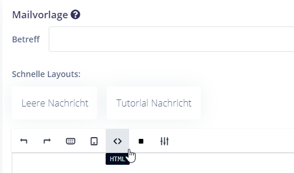

Mit E-Mail-Vorlagen innerhalb von amosWEB kannst du deine E-Mails, die das System automatisiert bei bestimmten Anlässen verschickt gestalten und an deine Bedürfnisse anpassen. Als [Bezirksjugendwerk](https://ejwleo.de/) haben wir dies in akribischer Arbeit nach dem Umstieg auf amosWEB erledigt und unsere Texte sowie die generelle Darstellung lange optimiert, bis sie für unsere Zwecke - das Anmeldemanagement für unsere (Sommer-)Freizeiten und Jugendangebote - passend waren.

<!--more-->


  E-Mail-Vorlagen kannst du in amosWEB entweder innerhalb einer Veranstaltung oder mandant-weit ("global") innerhalb von **amosWEB** festlegen. ➡ **Wir empfehlen letzteres, da du so diese an nur einem ort zentral hinterlegt hast und Änderungen einfacher dort standardmäßig für alle Veranstaltungen gültig sind, solange du sie nicht lokal überschreibst.**


## Gestaltung & Struktur

Der Aufbau & das Design unserer Vorlage gliedert sich in mehrere Blöcke:

1. Logo der Organisation
1. Betreffzeile/Überschrift
1. Haupt-Textabschnitt inkl. persönlicher Anrede
1. Kontaktdaten des Absenders (i.d.R. Sachbearbeiter*in)
1. allgemeine Informationen & Angaben zur Organisation (Öffnungszeiten, Kontaktdaten, Ansprechpartner, Social-Media)
1. Rechtliche Angaben (Impressum, Datenschutz, ...)
1. Herkunftsangaben der E-Mail (für Transparenz gegenüber Empfänger)

## Hinweise und Tipps

Bitte beachte bei der Verwendung unserer Vorlagen noch folgende Hinweise:

- Die E-Mail-Vorlagen enthalten Platzhalter-Texte, damit nicht aus Versehen unsere realen Inhalte wie IBAN, Öffnungszeiten oder Ansprechpartner übernommen werden. ➡ Bitte tausche diese vor der Übernahme gegen deine aus.
- Das eingebettete Logo im Kopf solltest du ebenfalls gegen dein eigenes austauschen.
- In der Vorlage binden wir Icons für die sozialen Netzwerke ein. Du kannst als Quelle für diese Grafiken entweder den hinterlegten Link beibehalten oder die Dateien [hier](https://github.com/ejwleo/amosweb/blob/main/static/icons/) herunterladen und auf eurem eigenen Webserver/Website hochladen und von dort verknüpfen.
- Beim einfügen der E-Mail-Vorlagen wird **nur** der Mail-Körper übernommen, jedoch nicht der Betreff, etwaige weitere Empfänger im `CC`/`BCC` und/oder Anhänge oder Filter-Regeln. Falls wir diese für empfehlenswert halten sind diese unten entsprechend angegeben.
- Je nach Logik und Filtern kann es passieren, dass Teilnehmende (wenn diese bspw. sowohl TN als auch RE sind) E-Mails doppelt bekommen. ➡ Damit hier keine Missverständnisse entstehen haben wir dazu einen entsprechenden Hinweis in unsere Vorlagen integriert.
- 💡 **Tipp:** Nimm eine beliebige Vorlage als Ausgangsbasis, passe daran alle entsprechenden Texte an deine Bedürfnisse an, ändere ggf. Farben und Logos und speichere diese Vorlage anschließend einmal für dich ab.
- Der Editor von amosWEB unterstützt bisher keine Hervorhebungen/fett-markierte Texte über die Bedienleiste - du kannst dafür jedoch einfach den anzupassenden Text markieren und mit den folgenden Tastenkombinationen entsprechend hervorheben. Bei erneutem Drücken der Tastenkombination machst du die Änderung wieder rückgängig.
  - `STRG` + `b` ➡ **Hervorhebung in fett**
  - `STRG` + `i` ➡ _Hervorhebung kursiv_
  - `STRG` + `u` ➡ <ins>Hervorhebung durch unterstreichen</ins>
  - Alternativ kannst du natürlich auch direkt manuell im HTML-Editor die klassischen Tags `<b>` bzw. `</b>` etc. einfügen.
  - 
- Unsere Vorlage kannst du natürlich auch über den in amosWEB integrierten Editor bearbeiten. **Wo möglich solltest du dies auch tun!**
